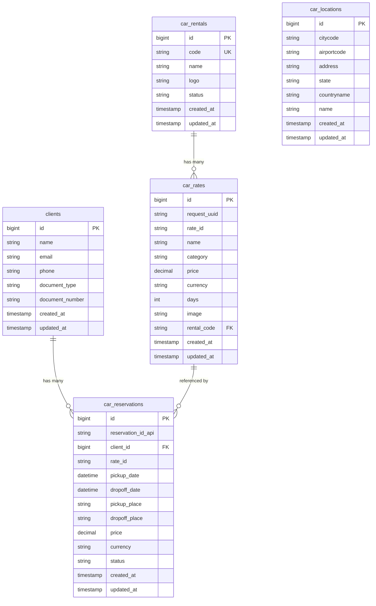

# Database Schema - Módulo de Renta de Autos

## 📋 Índice

1. [Tablas Principales](#tablas-principales)
2. [Relaciones](#relaciones)
3. [Índices](#índices)
4. [Seeders](#seeders)
5. [Migraciones](#migraciones)
6. [Diagrama ER](#diagrama-er)

## 🗄️ Tablas Principales

### car_rentals

Tabla que almacena las empresas de renta de autos.

```sql
CREATE TABLE car_rentals (
    id BIGINT UNSIGNED AUTO_INCREMENT PRIMARY KEY,
    code VARCHAR(255) NOT NULL UNIQUE,
    name VARCHAR(255) NOT NULL,
    logo VARCHAR(255) NULL,
    status VARCHAR(255) NOT NULL DEFAULT 'active',
    created_at TIMESTAMP NULL,
    updated_at TIMESTAMP NULL
);
```

**Campos:**
- `id`: Clave primaria auto-incremental
- `code`: Código único de la empresa (ej: 'Hertz', 'Avis')
- `name`: Nombre de la empresa
- `logo`: URL del logo de la empresa (opcional)
- `status`: Estado de la empresa ('active', 'inactive')
- `created_at`: Fecha de creación
- `updated_at`: Fecha de última actualización

**Datos de Ejemplo:**
```sql
INSERT INTO car_rentals (code, name, logo, status) VALUES
('ZE', 'Hertz', 'https://example.com/hertz-logo.png', 'active'),
('SX', 'Sixt', 'https://example.com/sixt-logo.png', 'active'),
('ZI', 'Avis', 'https://example.com/avis-logo.png', 'active'),
('ZD', 'Budget', 'https://example.com/budget-logo.png', 'active');
```

### car_locations

Tabla que almacena las ubicaciones de recogida y devolución.

```sql
CREATE TABLE car_locations (
    id BIGINT UNSIGNED AUTO_INCREMENT PRIMARY KEY,
    citycode VARCHAR(255) NOT NULL,
    airportcode VARCHAR(255) NULL,
    address VARCHAR(255) NULL,
    state VARCHAR(255) NULL,
    countryname VARCHAR(255) NOT NULL,
    name VARCHAR(255) NOT NULL,
    created_at TIMESTAMP NULL,
    updated_at TIMESTAMP NULL,
    INDEX idx_citycode (citycode)
);
```

**Campos:**
- `id`: Clave primaria auto-incremental
- `citycode`: Código de la ciudad (ej: 'BOG', 'MDE')
- `airportcode`: Código del aeropuerto (opcional)
- `address`: Dirección específica
- `state`: Estado o departamento
- `countryname`: Nombre del país
- `name`: Nombre de la ubicación
- `created_at`: Fecha de creación
- `updated_at`: Fecha de última actualización

**Datos de Ejemplo:**
```sql
INSERT INTO car_locations (citycode, airportcode, address, state, countryname, name) VALUES
('BOG', 'BOG', 'Aeropuerto El Dorado, Bogotá', 'Cundinamarca', 'Colombia', 'Bogotá'),
('MDE', 'MDE', 'Aeropuerto José María Córdova, Medellín', 'Antioquia', 'Colombia', 'Medellín'),
('MIA', 'MIA', 'Miami International Airport, Miami', 'Florida', 'United States', 'Miami');
```

### car_rates

Tabla que almacena las tarifas de vehículos disponibles.

```sql
CREATE TABLE car_rates (
    id BIGINT UNSIGNED AUTO_INCREMENT PRIMARY KEY,
    request_uuid VARCHAR(255) NOT NULL,
    rate_id VARCHAR(255) NOT NULL,
    name VARCHAR(255) NOT NULL,
    category VARCHAR(255) NULL,
    price DECIMAL(12,2) NOT NULL,
    currency VARCHAR(3) NOT NULL,
    days INT NOT NULL,
    image VARCHAR(255) NULL,
    rental_code VARCHAR(255) NOT NULL,
    created_at TIMESTAMP NULL,
    updated_at TIMESTAMP NULL,
    INDEX idx_request_uuid (request_uuid),
    INDEX idx_rate_id (rate_id),
    FOREIGN KEY (rental_code) REFERENCES car_rentals(code) ON DELETE CASCADE
);
```

**Campos:**
- `id`: Clave primaria auto-incremental
- `request_uuid`: UUID de la solicitud de búsqueda
- `rate_id`: ID único de la tarifa
- `name`: Nombre del vehículo
- `category`: Categoría del vehículo (ej: 'Compacto', 'SUV')
- `price`: Precio total de la renta
- `currency`: Moneda (ej: 'USD', 'COP')
- `days`: Número de días de renta
- `image`: URL de la imagen del vehículo
- `rental_code`: Código de la empresa (FK a car_rentals)
- `created_at`: Fecha de creación
- `updated_at`: Fecha de última actualización

**Datos de Ejemplo:**
```sql
INSERT INTO car_rates (request_uuid, rate_id, name, category, price, currency, days, rental_code) VALUES
('req_123456', 'rate_001', 'Toyota Corolla', 'Compacto', 150.00, 'USD', 3, 'ZE'),
('req_123456', 'rate_002', 'Kia Sportage', 'SUV', 200.00, 'USD', 3, 'SX'),
('req_123456', 'rate_003', 'BMW 3 Series', 'Lujo', 300.00, 'USD', 3, 'ZI');
```

### car_reservations

Tabla que almacena las reservas de vehículos.

```sql
CREATE TABLE car_reservations (
    id BIGINT UNSIGNED AUTO_INCREMENT PRIMARY KEY,
    reservation_id_api VARCHAR(255) NOT NULL,
    client_id BIGINT UNSIGNED NOT NULL,
    rate_id VARCHAR(255) NOT NULL,
    pickup_date DATETIME NOT NULL,
    dropoff_date DATETIME NOT NULL,
    pickup_place VARCHAR(255) NOT NULL,
    dropoff_place VARCHAR(255) NOT NULL,
    price DECIMAL(12,2) NOT NULL,
    currency VARCHAR(3) NOT NULL,
    status VARCHAR(255) NOT NULL DEFAULT 'confirmed',
    created_at TIMESTAMP NULL,
    updated_at TIMESTAMP NULL,
    INDEX idx_reservation_id_api (reservation_id_api),
    INDEX idx_rate_id (rate_id),
    FOREIGN KEY (client_id) REFERENCES clients(id) ON DELETE CASCADE
);
```

**Campos:**
- `id`: Clave primaria auto-incremental
- `reservation_id_api`: ID de la reserva en la API externa
- `client_id`: ID del cliente (FK a clients)
- `rate_id`: ID de la tarifa reservada
- `pickup_date`: Fecha y hora de recogida
- `dropoff_date`: Fecha y hora de devolución
- `pickup_place`: Lugar de recogida
- `dropoff_place`: Lugar de devolución
- `price`: Precio total de la reserva
- `currency`: Moneda de la reserva
- `status`: Estado de la reserva ('confirmed', 'cancelled', 'completed')
- `created_at`: Fecha de creación
- `updated_at`: Fecha de última actualización

**Datos de Ejemplo:**
```sql
INSERT INTO car_reservations (reservation_id_api, client_id, rate_id, pickup_date, dropoff_date, pickup_place, dropoff_place, price, currency, status) VALUES
('res_987654321', 1, 'rate_001', '2025-10-05 15:30:00', '2025-10-08 15:30:00', 'BOG', 'MDE', 450.00, 'USD', 'confirmed');
```

## 🔗 Relaciones

### Relación car_rentals → car_rates

```sql
-- Una empresa puede tener múltiples tarifas
car_rentals.code → car_rates.rental_code
```

**Tipo:** One-to-Many  
**Cardinalidad:** 1:N  
**Restricción:** ON DELETE CASCADE

### Relación clients → car_reservations

```sql
-- Un cliente puede tener múltiples reservas
clients.id → car_reservations.client_id
```

**Tipo:** One-to-Many  
**Cardinalidad:** 1:N  
**Restricción:** ON DELETE CASCADE

### Relación car_rates → car_reservations

```sql
-- Una tarifa puede tener múltiples reservas
car_rates.rate_id → car_reservations.rate_id
```

**Tipo:** One-to-Many  
**Cardinalidad:** 1:N  
**Restricción:** No hay restricción de integridad referencial

## 📊 Índices

### Índices de Rendimiento

```sql
-- car_locations
CREATE INDEX idx_citycode ON car_locations(citycode);

-- car_rates
CREATE INDEX idx_request_uuid ON car_rates(request_uuid);
CREATE INDEX idx_rate_id ON car_rates(rate_id);

-- car_reservations
CREATE INDEX idx_reservation_id_api ON car_reservations(reservation_id_api);
CREATE INDEX idx_rate_id ON car_reservations(rate_id);
```

### Índices Compuestos (Recomendados)

```sql
-- Para búsquedas por empresa y categoría
CREATE INDEX idx_rental_category ON car_rates(rental_code, category);

-- Para búsquedas por cliente y estado
CREATE INDEX idx_client_status ON car_reservations(client_id, status);

-- Para búsquedas por fechas
CREATE INDEX idx_pickup_dates ON car_reservations(pickup_date, dropoff_date);
```

## 🌱 Seeders

### CarRentalSeeder

```php
<?php

namespace Database\Seeders;

use App\Models\CarRental;
use Illuminate\Database\Seeder;

class CarRentalSeeder extends Seeder
{
    public function run(): void
    {
        $rentals = [
            ['code' => 'ZE', 'name' => 'Hertz', 'status' => 'active'],
            ['code' => 'SX', 'name' => 'Sixt', 'status' => 'active'],
            ['code' => 'ZI', 'name' => 'Avis', 'status' => 'active'],
            ['code' => 'ZD', 'name' => 'Budget', 'status' => 'active'],
        ];

        foreach ($rentals as $rental) {
            CarRental::create($rental);
        }
    }
}
```

### CarLocationSeeder

```php
<?php

namespace Database\Seeders;

use App\Models\CarLocation;
use Illuminate\Database\Seeder;

class CarLocationSeeder extends Seeder
{
    public function run(): void
    {
        $locations = [
            [
                'citycode' => 'BOG',
                'airportcode' => 'BOG',
                'address' => 'Aeropuerto El Dorado, Bogotá',
                'state' => 'Cundinamarca',
                'countryname' => 'Colombia',
                'name' => 'Bogotá',
            ],
            [
                'citycode' => 'MDE',
                'airportcode' => 'MDE',
                'address' => 'Aeropuerto José María Córdova, Medellín',
                'state' => 'Antioquia',
                'countryname' => 'Colombia',
                'name' => 'Medellín',
            ],
            // ... más ubicaciones
        ];

        foreach ($locations as $location) {
            CarLocation::updateOrCreate(
                ['citycode' => $location['citycode'], 'name' => $location['name']],
                $location
            );
        }
    }
}
```

### CarRateSeeder

```php
<?php

namespace Database\Seeders;

use App\Models\CarRate;
use Illuminate\Database\Seeder;

class CarRateSeeder extends Seeder
{
    public function run(): void
    {
        $rates = [
            [
                'request_uuid' => 'demo_001',
                'rate_id' => 'rate_001',
                'name' => 'Toyota Corolla',
                'category' => 'Compacto',
                'price' => 150.00,
                'currency' => 'USD',
                'days' => 3,
                'rental_code' => 'ZE',
            ],
            // ... más tarifas
        ];

        foreach ($rates as $rate) {
            CarRate::updateOrCreate(
                ['request_uuid' => $rate['request_uuid'], 'rate_id' => $rate['rate_id']],
                $rate
            );
        }
    }
}
```

### CarReservationSeeder

```php
<?php

namespace Database\Seeders;

use App\Models\CarReservation;
use Illuminate\Database\Seeder;

class CarReservationSeeder extends Seeder
{
    public function run(): void
    {
        $reservations = [
            [
                'reservation_id_api' => 'res_demo_001',
                'client_id' => 1,
                'rate_id' => 'rate_001',
                'pickup_date' => now()->addDays(2),
                'dropoff_date' => now()->addDays(5),
                'pickup_place' => 'Bogotá',
                'dropoff_place' => 'Medellín',
                'price' => 450.00,
                'currency' => 'USD',
                'status' => 'confirmed',
            ],
            // ... más reservas
        ];

        foreach ($reservations as $reservation) {
            CarReservation::create($reservation);
        }
    }
}
```

## 🚀 Migraciones

### create_car_rentals_table.php

```php
<?php

use Illuminate\Database\Migrations\Migration;
use Illuminate\Database\Schema\Blueprint;
use Illuminate\Support\Facades\Schema;

return new class extends Migration
{
    public function up(): void
    {
        Schema::create('car_rentals', function (Blueprint $table) {
            $table->id();
            $table->string('code')->unique();
            $table->string('name');
            $table->string('logo')->nullable();
            $table->string('status')->default('active');
            $table->timestamps();
        });
    }

    public function down(): void
    {
        Schema::dropIfExists('car_rentals');
    }
};
```

### create_car_locations_table.php

```php
<?php

use Illuminate\Database\Migrations\Migration;
use Illuminate\Database\Schema\Blueprint;
use Illuminate\Support\Facades\Schema;

return new class extends Migration
{
    public function up(): void
    {
        Schema::create('car_locations', function (Blueprint $table) {
            $table->id();
            $table->string('citycode')->index();
            $table->string('airportcode')->nullable();
            $table->string('address')->nullable();
            $table->string('state')->nullable();
            $table->string('countryname');
            $table->string('name');
            $table->timestamps();
        });
    }

    public function down(): void
    {
        Schema::dropIfExists('car_locations');
    }
};
```

### create_car_rates_table.php

```php
<?php

use Illuminate\Database\Migrations\Migration;
use Illuminate\Database\Schema\Blueprint;
use Illuminate\Support\Facades\Schema;

return new class extends Migration
{
    public function up(): void
    {
        Schema::create('car_rates', function (Blueprint $table) {
            $table->id();
            $table->string('request_uuid')->index();
            $table->string('rate_id')->index();
            $table->string('name');
            $table->string('category')->nullable();
            $table->decimal('price', 12, 2);
            $table->string('currency', 3);
            $table->integer('days');
            $table->string('image')->nullable();
            $table->string('rental_code');
            $table->timestamps();
            
            $table->foreign('rental_code')->references('code')->on('car_rentals');
        });
    }

    public function down(): void
    {
        Schema::dropIfExists('car_rates');
    }
};
```

### create_car_reservations_table.php

```php
<?php

use Illuminate\Database\Migrations\Migration;
use Illuminate\Database\Schema\Blueprint;
use Illuminate\Support\Facades\Schema;

return new class extends Migration
{
    public function up(): void
    {
        Schema::create('car_reservations', function (Blueprint $table) {
            $table->id();
            $table->string('reservation_id_api')->index();
            $table->foreignId('client_id')->constrained('clients');
            $table->string('rate_id')->index();
            $table->datetime('pickup_date');
            $table->datetime('dropoff_date');
            $table->string('pickup_place');
            $table->string('dropoff_place');
            $table->decimal('price', 12, 2);
            $table->string('currency', 3);
            $table->string('status')->default('confirmed');
            $table->timestamps();
        });
    }

    public function down(): void
    {
        Schema::dropIfExists('car_reservations');
    }
};
```

## 📊 Diagrama ER



## 🔧 Consultas Útiles

### Obtener Tarifas con Información de Empresa

```sql
SELECT 
    cr.*,
    crl.name as rental_name,
    crl.logo as rental_logo
FROM car_rates cr
JOIN car_rentals crl ON cr.rental_code = crl.code
WHERE cr.request_uuid = 'req_123456'
ORDER BY cr.price ASC;
```

### Obtener Reservas con Detalles Completos

```sql
SELECT 
    cres.*,
    c.name as client_name,
    c.email as client_email,
    cr.name as car_name,
    cr.category as car_category,
    crl.name as rental_name
FROM car_reservations cres
JOIN clients c ON cres.client_id = c.id
JOIN car_rates cr ON cres.rate_id = cr.rate_id
JOIN car_rentals crl ON cr.rental_code = crl.code
WHERE cres.client_id = 1
ORDER BY cres.created_at DESC;
```

### Estadísticas de Reservas por Empresa

```sql
SELECT 
    crl.name as rental_name,
    COUNT(cres.id) as total_reservations,
    SUM(cres.price) as total_revenue,
    AVG(cres.price) as average_price
FROM car_rentals crl
LEFT JOIN car_rates cr ON crl.code = cr.rental_code
LEFT JOIN car_reservations cres ON cr.rate_id = cres.rate_id
GROUP BY crl.id, crl.name
ORDER BY total_reservations DESC;
```

---

## 📞 Soporte

Para más información sobre el esquema de base de datos, consultar la documentación completa o contactar al equipo de desarrollo.

**Versión**: 1.0.0  
**Última actualización**: Septiembre 2025
