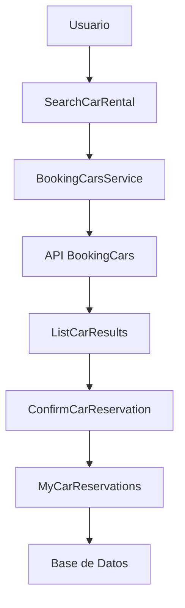

# Módulo de Renta de Autos - Documentación Técnica

## 📋 Índice

1. [Introducción](#introducción)
2. [Arquitectura del Sistema](#arquitectura-del-sistema)
3. [Configuración](#configuración)
4. [API Endpoints](#api-endpoints)
5. [Componentes Livewire](#componentes-livewire)
6. [Modelos de Datos](#modelos-de-datos)
7. [Servicios](#servicios)
8. [Base de Datos](#base-de-datos)
9. [Testing](#testing)
10. [Despliegue](#despliegue)
11. [Troubleshooting](#troubleshooting)

## 🚗 Introducción

El módulo de renta de autos es una funcionalidad completa integrada en el CRM que permite a los usuarios buscar, comparar y reservar vehículos de alquiler a través de la API de BookingCars.

### Características Principales

- **Búsqueda de Vehículos**: Autocomplete inteligente para ubicaciones
- **Comparación de Precios**: Múltiples opciones con filtros avanzados
- **Reservas**: Sistema completo de reservas con confirmación
- **Gestión de Reservas**: Visualización y cancelación de reservas existentes
- **Modo Demo**: Funcionalidad completa sin API real para desarrollo

## 🏗️ Arquitectura del Sistema

### Componentes Principales

```
📁 app/
├── 📁 Livewire/CarRental/
│   ├── SearchCarRental.php      # Búsqueda de vehículos
│   ├── ListCarResults.php       # Lista de resultados
│   ├── ConfirmCarReservation.php # Confirmación de reserva
│   └── MyCarReservations.php    # Gestión de reservas
├── 📁 Models/
│   ├── CarRental.php            # Empresas de renta
│   ├── CarLocation.php          # Ubicaciones
│   ├── CarRate.php              # Tarifas de vehículos
│   └── CarReservation.php       # Reservas
├── 📁 Services/
│   └── BookingCarsService.php   # Servicio de API
└── 📁 Http/Controllers/
    └── CarRentalTestController.php # Controlador de pruebas
```

### Flujo de Datos



## ⚙️ Configuración

### Variables de Entorno

```env
# BookingCars API Configuration
BOOKINGCARS_BASE_URL=https://api.bookingcars.com
BOOKINGCARS_API_KEY=your_api_key_here
```

### Configuración de Servicios

```php
// config/services.php
'bookingcars' => [
    'base_url' => env('BOOKINGCARS_BASE_URL', 'https://api.bookingcars.com'),
    'api_key' => env('BOOKINGCARS_API_KEY'),
],
```

### Configuración de Sesiones

```php
// config/session.php
'driver' => env('SESSION_DRIVER', 'file'),
```

## 🔌 API Endpoints

### Rutas Principales

```php
// routes/modules/services/car-rentals.php
Route::prefix('car-rentals')->group(function () {
    Route::get('/search', SearchCarRental::class)->name('car-rentals.search');
    Route::get('/results', ListCarResults::class)->name('car-rentals.results');
    Route::get('/confirm/{id}', ConfirmCarReservation::class)->name('car-rentals.confirm');
    Route::get('/my-reservations', MyCarReservations::class)->name('car-rentals.my-reservations');
});
```

### Rutas de Pruebas

```php
// Rutas de testing (opcionales)
Route::prefix('car-rentals/test')->group(function () {
    Route::get('/rentals', [CarRentalTestController::class, 'rentals']);
    Route::get('/locations/{query}', [CarRentalTestController::class, 'locations']);
    Route::get('/availability', [CarRentalTestController::class, 'availability']);
    Route::get('/reservation/{id}', [CarRentalTestController::class, 'reservation']);
});
```

## 🎯 Componentes Livewire

### SearchCarRental

**Propósito**: Búsqueda inicial de vehículos con autocomplete

**Propiedades**:
- `pickupQuery`, `pickupResults`, `pickupSelected`
- `dropoffQuery`, `dropoffResults`, `dropoffSelected`
- `pickupDate`, `dropoffDate`, `currency`

**Métodos Principales**:
- `searchPickupLocations()`: Autocomplete de ubicaciones
- `searchDropoffLocations()`: Autocomplete de ubicaciones
- `search()`: Búsqueda de disponibilidad

### ListCarResults

**Propósito**: Visualización de resultados con filtros y paginación

**Características**:
- Paginación de 12 elementos por página
- Filtros por categoría y precio
- Ordenamiento por precio y nombre
- Modal de confirmación

### ConfirmCarReservation

**Propósito**: Proceso de confirmación de reserva

**Funcionalidades**:
- Formulario de datos del conductor
- Selección de método de pago
- Validación de datos
- Creación de reserva

### MyCarReservations

**Propósito**: Gestión de reservas existentes

**Características**:
- Lista de reservas del usuario
- Detalles de cada reserva
- Opción de cancelación
- Estados de reserva

## 📊 Modelos de Datos

### CarRental

```php
// Empresas de renta de autos
Schema::create('car_rentals', function (Blueprint $table) {
    $table->id();
    $table->string('code')->unique();
    $table->string('name');
    $table->string('logo')->nullable();
    $table->string('status')->default('active');
    $table->timestamps();
});
```

### CarLocation

```php
// Ubicaciones de recogida/devolución
Schema::create('car_locations', function (Blueprint $table) {
    $table->id();
    $table->string('citycode')->index();
    $table->string('airportcode')->nullable();
    $table->string('address')->nullable();
    $table->string('state')->nullable();
    $table->string('countryname');
    $table->string('name');
    $table->timestamps();
});
```

### CarRate

```php
// Tarifas de vehículos
Schema::create('car_rates', function (Blueprint $table) {
    $table->id();
    $table->string('request_uuid')->index();
    $table->string('rate_id')->index();
    $table->string('name');
    $table->string('category')->nullable();
    $table->decimal('price', 12, 2);
    $table->string('currency', 3);
    $table->integer('days');
    $table->string('image')->nullable();
    $table->string('rental_code');
    $table->timestamps();
    
    $table->foreign('rental_code')->references('code')->on('car_rentals');
});
```

### CarReservation

```php
// Reservas de vehículos
Schema::create('car_reservations', function (Blueprint $table) {
    $table->id();
    $table->string('reservation_id_api')->index();
    $table->foreignId('client_id')->constrained('clients');
    $table->string('rate_id')->index();
    $table->datetime('pickup_date');
    $table->datetime('dropoff_date');
    $table->string('pickup_place');
    $table->string('dropoff_place');
    $table->decimal('price', 12, 2);
    $table->string('currency', 3);
    $table->string('status')->default('confirmed');
    $table->timestamps();
});
```

## 🔧 Servicios

### BookingCarsService

**Propósito**: Integración con la API de BookingCars

**Métodos Principales**:

```php
// Autenticación
public function authenticate(): array

// Búsqueda de ubicaciones
public function getLocations(string $query): array

// Búsqueda de disponibilidad
public function getAvailability(array $params): array

// Información de tarifas
public function getRateInformation(string $requestUUID, string $rateId): array

// Creación de reservas
public function createReservation(array $data): array

// Cancelación de reservas
public function cancelReservation(string $reservationId, string $companyCode): array

// Consulta de reservas
public function getReservation(string $id): array
```

**Formato de Respuesta**:
```php
[
    'status' => bool,
    'data' => array|null,
    'error' => string|null
]
```

## 🗄️ Base de Datos

### Migraciones

1. `create_car_rentals_table.php`
2. `create_car_locations_table.php`
3. `create_car_rates_table.php`
4. `create_car_reservations_table.php`

### Seeders

1. `CarRentalSeeder`: Empresas de renta
2. `CarLocationSeeder`: Ubicaciones de prueba
3. `CarRateSeeder`: Tarifas de ejemplo
4. `CarReservationSeeder`: Reservas de prueba

### Relaciones

```php
// CarRental
public function rates(): HasMany

// CarRate
public function carRental(): BelongsTo
public function reservations(): HasMany

// CarReservation
public function client(): BelongsTo
public function carRate(): BelongsTo
```

## 🧪 Testing

### Tests de Feature

- `CarRentalTest.php`: Tests principales del módulo
- `BookingCarsServiceTest.php`: Tests del servicio API
- `CarReservationTest.php`: Tests de reservas
- `CarRentalAutocompleteTest.php`: Tests de autocomplete

### Tests de Unit

- `CarRentalRelationshipsTest.php`: Tests de relaciones de modelos

### Ejecutar Tests

```bash
# Todos los tests del módulo
php artisan test --filter=CarRental

# Tests específicos
php artisan test tests/Feature/CarRentalTest.php
php artisan test tests/Feature/BookingCarsServiceTest.php
```

## 🚀 Despliegue

### Requisitos

- PHP 8.1+
- Laravel 11+
- MySQL 8.0+
- Composer

### Pasos de Instalación

1. **Instalar dependencias**:
```bash
composer install
```

2. **Configurar variables de entorno**:
```env
BOOKINGCARS_BASE_URL=https://api.bookingcars.com
BOOKINGCARS_API_KEY=your_api_key_here
```

3. **Ejecutar migraciones**:
```bash
php artisan migrate
```

4. **Ejecutar seeders**:
```bash
php artisan db:seed --class=CarRentalSeeder
php artisan db:seed --class=CarLocationSeeder
php artisan db:seed --class=CarRateSeeder
php artisan db:seed --class=CarReservationSeeder
```

5. **Limpiar caché**:
```bash
php artisan config:clear
php artisan cache:clear
```

## 🔧 Troubleshooting

### Problemas Comunes

#### 1. Error de Serialización de Livewire
```
Property type not supported in Livewire
```
**Solución**: Usar computed properties en lugar de propiedades públicas complejas.

#### 2. Error de Clave Foránea
```
SQLSTATE[23000]: Integrity constraint violation
```
**Solución**: Verificar que los códigos de empresa existan en la tabla `car_rentals`.

#### 3. Error de Base de Datos
```
SQLSTATE[HY000] [1049] Unknown database 'laravel'
```
**Solución**: Verificar configuración de sesiones en `config/session.php`.

#### 4. Autocomplete No Funciona
**Solución**: Verificar que la API key esté configurada o usar modo demo.

### Logs de Debug

Los logs se encuentran en `storage/logs/laravel.log` y incluyen:
- Búsquedas de ubicaciones
- Llamadas a la API de BookingCars
- Errores de autenticación
- Errores de reservas

### Modo Demo

El módulo incluye un modo demo que funciona sin API real:
- Datos mock para ubicaciones
- Tarifas de ejemplo
- Precios calculados dinámicamente
- Imágenes de Unsplash

Para activar el modo demo, mantener `BOOKINGCARS_API_KEY=your_api_key_here` en el `.env`.

---

## 📞 Soporte

Para soporte técnico o reportar bugs, contactar al equipo de desarrollo o crear un issue en el repositorio.

**Versión**: 1.0.0  
**Última actualización**: Septiembre 2025  
**Autor**: MVP Solutions 365
