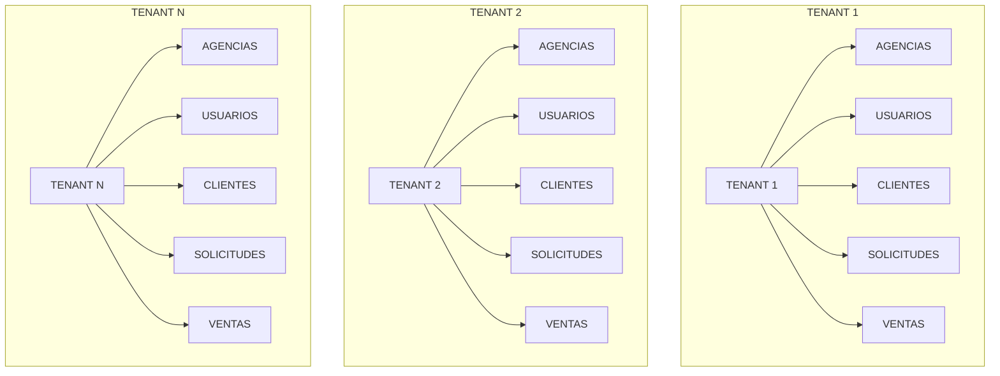
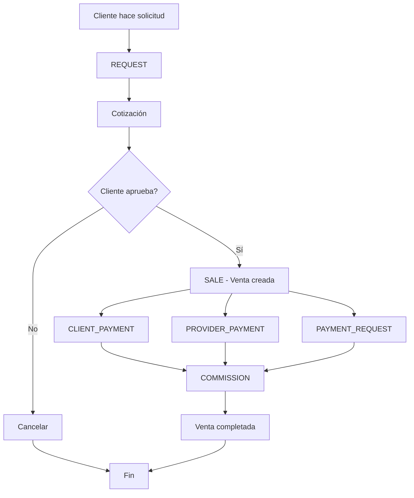
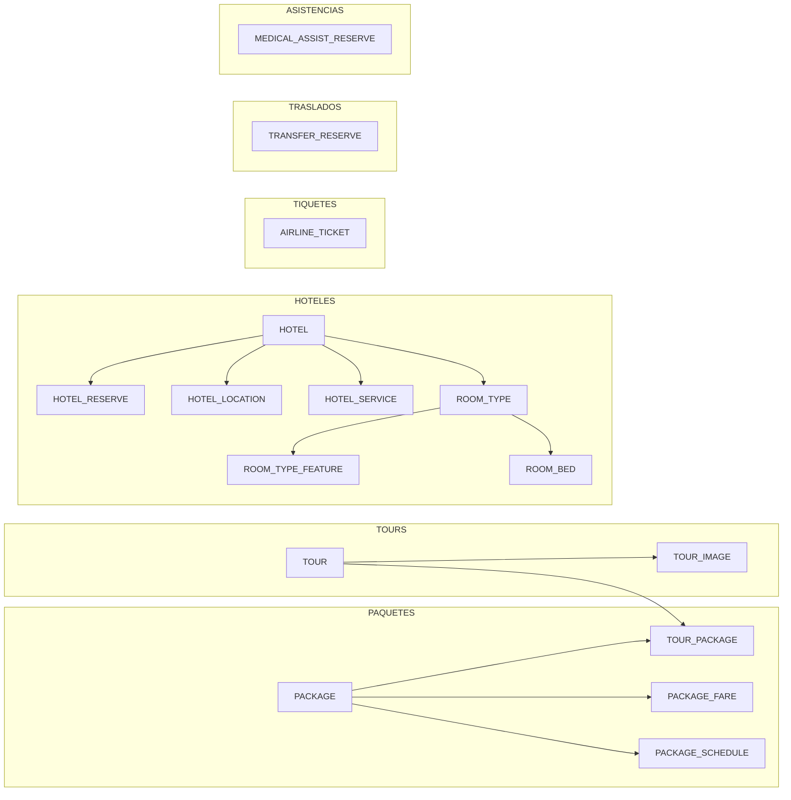
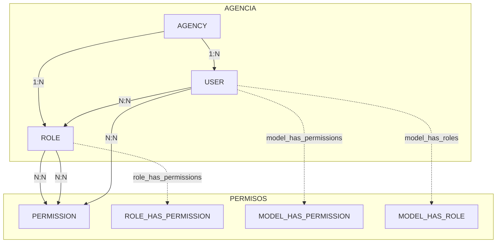
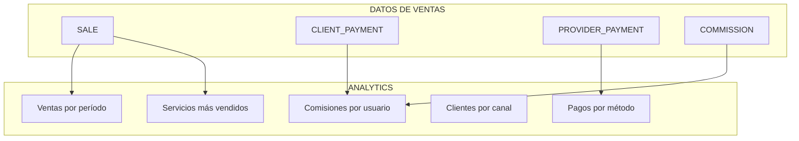
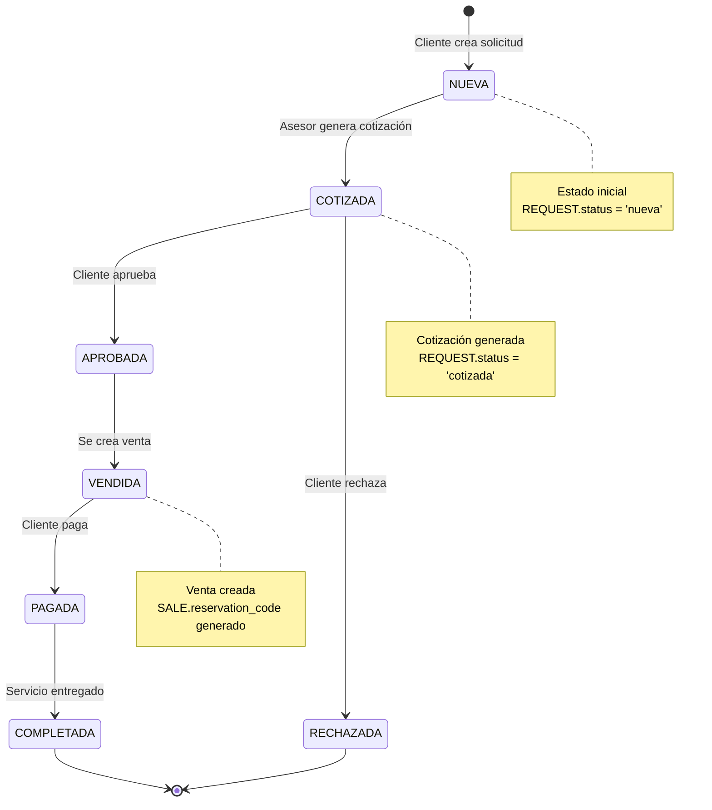
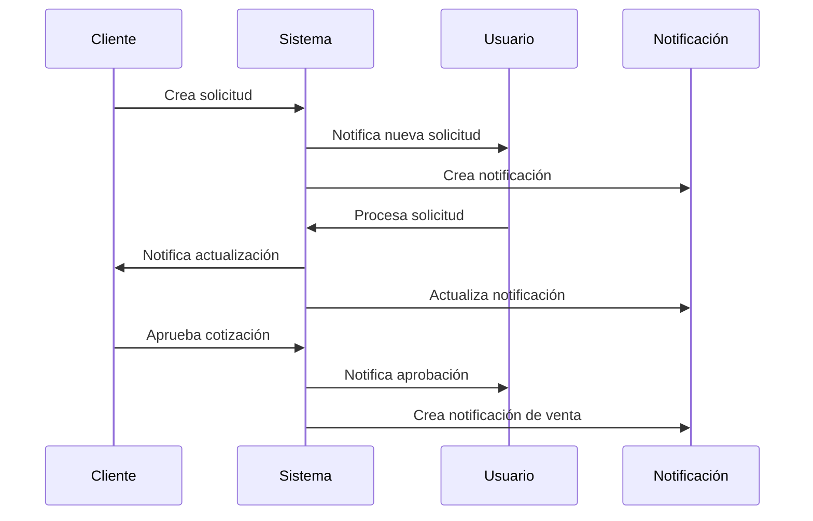

# 📊 Diagramas de Relaciones - CRM AMS365

## 🎯 Diagrama Principal de Entidades

```mermaid
erDiagram
    TENANT {
        uuid id PK
        string name
        string slug UK
        timestamp created_at
        timestamp updated_at
        timestamp deleted_at
    }
    
    AGENCY {
        bigint id PK
        uuid tenant_id FK
        string name
        enum entity_type
        string type
        string slug
        string nit UK
        string status
        string logo
        timestamp created_at
        timestamp updated_at
    }
    
    OFFICE {
        bigint id PK
        bigint agency_id FK
        string name
        string slug
        string status
        string rnt UK
        string address
        string complement
        string office_manager
        string phone
        string email
        text observations
        json corporate_colors
        timestamp created_at
        timestamp updated_at
    }
    
    USER {
        bigint id PK
        uuid tenant_id FK
        string name
        string email UK
        string slug
        string phone
        string status
        boolean superadmin
        string type
        timestamp email_verified_at
        string password
        string remember_token
        bigint personnel_id FK
        bigint agency_id FK
        timestamp created_at
        timestamp updated_at
    }
    
    CLIENT {
        bigint id PK
        bigint agency_id FK
        string name
        string slug UK
        string email UK
        string phone
        text address
        enum client_type
        string document_type
        string document_number
        string nationality
        string inlet_channel
        bigint referred_by FK
        uuid tenant_id FK
        timestamp created_at
        timestamp updated_at
    }
    
    REQUEST {
        bigint id PK
        uuid tenant_id FK
        uuid agency_id FK
        bigint client_id FK
        bigint user_id FK
        date request_date
        string slug UK
        string request_type
        string destination_type
        string origin_country
        string origin_city
        string destination_country
        string destination_city
        string origin
        string destination
        date departure_date
        date return_date
        integer adult
        integer children
        integer infant
        decimal quotation_value
        string currency
        string status
        text description
        json services
        text created_by
        boolean is_public
        string public_token
        timestamp deleted_at
        timestamp created_at
        timestamp updated_at
    }
    
    SALE {
        bigint id PK
        uuid tenant_id FK
        bigint agency_id FK
        bigint request_id FK
        bigint client_id FK
        bigint user_id FK
        string reservation_code UK
        integer total_fare
        integer total_provider
        text created_by
        timestamp created_at
        timestamp updated_at
        timestamp deleted_at
    }
    
    CLIENT_PAYMENT {
        bigint id PK
        bigint sale_id FK
        bigint agency_id FK
        bigint request_id FK
        bigint client_id FK
        bigint user_id FK
        string reservation_code
        string client_name
        integer amount
        integer balance_due
        integer payment_number
        date payment_date
        string payment_method
        string payment_proof
        string status
        text ocr_text
        decimal ocr_confidence
        text created_by
        timestamp created_at
        timestamp updated_at
    }
    
    PROVIDER_PAYMENT {
        bigint id PK
        bigint agency_id FK
        bigint provider_id FK
        bigint user_id FK
        string service_type
        bigint service_id
        integer amount
        date payment_date
        string payment_method
        string payment_proof
        string status
        text created_by
        timestamp created_at
        timestamp updated_at
    }
    
    PACKAGE {
        bigint id PK
        bigint agency_id FK
        string title
        string origin
        string destination
        longtext include
        longtext no_include
        longtext itinerary
        longtext details
        enum status
        date valid_from
        date valid_until
        integer available_units
        string main_image
        json gallery_images
        string document_file
        timestamp created_at
        timestamp updated_at
    }
    
    HOTEL {
        bigint id PK
        bigint agency_id FK
        string name
        text description
        integer stars
        text address
        string phone
        string email
        string website
        enum status
        timestamp created_at
        timestamp updated_at
    }
    
    TOUR {
        bigint id PK
        bigint agency_id FK
        string name
        text description
        integer duration
        string difficulty
        integer max_participants
        decimal price_per_person
        enum status
        timestamp created_at
        timestamp updated_at
    }
    
    PROVIDER {
        bigint id PK
        string name
        bigint agency_id FK
        string type
        json service_type
        string link
        boolean commissionable
        integer commission_percentage
        string nit UK
        boolean requires_payment_report
        string payment_channel
        string contact_payment_channel
        mediumtext observations
        timestamp created_at
        timestamp updated_at
    }
    
    ROLE {
        bigint id PK
        bigint agency_id FK
        string name
        string guard_name
        text description
        boolean is_system_role
        boolean is_active
        timestamp created_at
        timestamp updated_at
    }
    
    PERMISSION {
        bigint id PK
        string name
        string guard_name
        timestamp created_at
        timestamp updated_at
    }
    
    TASK {
        bigint id PK
        bigint agency_id FK
        bigint assigned_to FK
        bigint assigned_by FK
        string title
        text description
        enum priority
        enum status
        date due_date
        timestamp completed_at
        timestamp created_at
        timestamp updated_at
    }
    
    OBSERVATION {
        bigint id PK
        string observable_type
        bigint observable_id
        bigint user_id FK
        text observation
        string type
        boolean is_important
        timestamp created_at
        timestamp updated_at
    }
    
    NOTIFICATION {
        char id PK
        string type
        string notifiable_type
        bigint notifiable_id
        json data
        timestamp read_at
        timestamp created_at
        timestamp updated_at
    }
```

## 🔗 Relaciones Principales

```mermaid
graph TD
    T[TENANT] -->|1:N| A[AGENCY]
    T -->|1:N| U[USER]
    T -->|1:N| C[CLIENT]
    T -->|1:N| R[REQUEST]
    
    A -->|1:N| O[OFFICE]
    A -->|1:N| P[PERSONNEL]
    A -->|1:N| U2[USER]
    A -->|1:N| C2[CLIENT]
    A -->|1:N| R2[REQUEST]
    A -->|1:N| S[SALE]
    A -->|1:N| PK[PACKAGE]
    A -->|1:N| H[HOTEL]
    A -->|1:N| TO[TOUR]
    A -->|1:N| PR[PROVIDER]
    A -->|1:N| RO[ROLE]
    
    U -->|N:1| A2[AGENCY]
    U -->|N:1| O2[OFFICE]
    U -->|N:1| P2[PERSONNEL]
    U -->|1:N| C3[CLIENT]
    U -->|1:N| R3[REQUEST]
    U -->|1:N| S2[SALE]
    U -->|1:N| CP[CLIENT_PAYMENT]
    U -->|1:N| PP[PROVIDER_PAYMENT]
    
    C -->|N:1| A3[AGENCY]
    C -->|N:1| U3[USER]
    C -->|1:N| R4[REQUEST]
    C -->|1:N| T2[TASK]
    C -->|1:N| AT[AIRLINE_TICKET]
    
    R -->|N:1| T3[TENANT]
    R -->|N:1| A4[AGENCY]
    R -->|N:1| C4[CLIENT]
    R -->|N:1| U4[USER]
    R -->|1:1| S3[SALE]
    R -->|1:N| CP2[CLIENT_PAYMENT]
    R -->|1:N| PP2[PROVIDER_PAYMENT]
    R -->|1:N| PR2[PAYMENT_REQUEST]
    
    S -->|N:1| T4[TENANT]
    S -->|N:1| A5[AGENCY]
    S -->|N:1| R5[REQUEST]
    S -->|N:1| C5[CLIENT]
    S -->|N:1| U5[USER]
    S -->|1:N| CP3[CLIENT_PAYMENT]
    S -->|1:N| PP3[PROVIDER_PAYMENT]
    S -->|1:N| PR3[PAYMENT_REQUEST]
    
    PK -->|N:1| A6[AGENCY]
    PK -->|1:N| PS[PACKAGE_SCHEDULE]
    PK -->|1:N| PF[PACKAGE_FARE]
    PK -->|1:N| TP[TOUR_PACKAGE]
    
    TO -->|N:1| A7[AGENCY]
    TO -->|1:N| TP2[TOUR_PACKAGE]
    TO -->|1:N| TI[TOUR_IMAGE]
    
    H -->|N:1| A8[AGENCY]
    H -->|1:N| HR[HOTEL_RESERVE]
    H -->|1:N| HL[HOTEL_LOCATION]
    H -->|1:N| HS[HOTEL_SERVICE]
    H -->|1:N| RT[ROOM_TYPE]
    
    RO -->|N:1| A9[AGENCY]
    RO -->|N:N| PE[PERMISSION]
    U -->|N:N| RO2[ROLE]
    U -->|N:N| PE2[PERMISSION]
```

## 🏗️ Arquitectura Multitenant

## 🔄 Flujo de Ventas

## 🏨 Servicios Turísticos

## 🔐 Sistema de Permisos

## 📊 Métricas y Analytics

## 🔄 Estados de Solicitudes

## 📱 Flujo de Notificaciones

---

*Diagramas generados para CRM AMS365*
*Última actualización: {{ date('Y-m-d H:i:s') }}*
