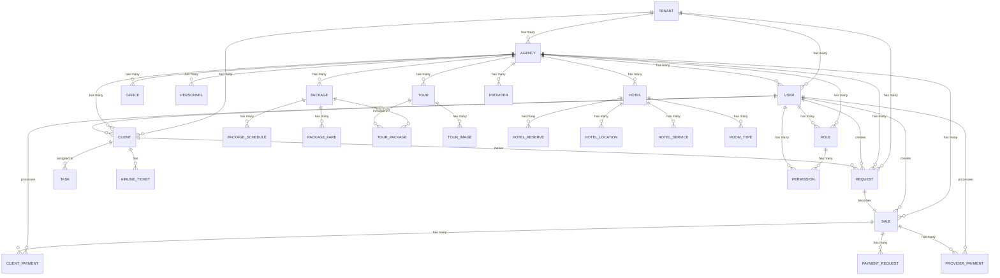

# 📊 Documentación de Base de Datos - CRM AMS365

## 📋 Índice
1. [Resumen Ejecutivo](#resumen-ejecutivo)
2. [Arquitectura General](#arquitectura-general)
3. [Tablas del Sistema](#tablas-del-sistema)
4. [Relaciones entre Tablas](#relaciones-entre-tablas)
5. [Modelos Eloquent](#modelos-eloquent)
6. [Diagrama de Relaciones](#diagrama-de-relaciones)
7. [Consideraciones Técnicas](#consideraciones-técnicas)

---

## 🎯 Resumen Ejecutivo

El CRM AMS365 utiliza una arquitectura de base de datos multitenant con **47 tablas principales** que gestionan:

- **Gestión Multi-tenant**: Separación de datos por tenant
- **Agencias y Oficinas**: Estructura organizacional jerárquica
- **Usuarios y Permisos**: Sistema de roles granular con Spatie Permission
- **Clientes y Solicitudes**: Gestión completa del ciclo de ventas
- **Servicios Turísticos**: Hoteles, tiquetes, traslados, tours, paquetes
- **Sistema de Pagos**: Pagos de clientes y proveedores con distribución
- **Contabilidad**: Comisiones, verificaciones y reportes

---

## 🏗️ Arquitectura General

### Principios de Diseño
- **Multitenancy**: Cada tenant tiene sus propios datos aislados
- **Soft Deletes**: Eliminación lógica para preservar integridad
- **Auditoría**: Campos `created_by`, `updated_at` en tablas críticas
- **Slugs**: URLs amigables para entidades principales
- **JSON Fields**: Almacenamiento flexible para configuraciones

### Tecnologías
- **Laravel 11**: Framework PHP
- **MySQL/MariaDB**: Motor de base de datos
- **Eloquent ORM**: Mapeo objeto-relacional
- **Spatie Permission**: Gestión de roles y permisos
- **Laravel Sanctum**: Autenticación API

---

## 📊 Tablas del Sistema

### 1. **Tablas de Configuración Multitenant**

#### `tenants`
| Campo | Tipo | Descripción | Restricciones |
|-------|------|-------------|---------------|
| `id` | UUID | Identificador único | PRIMARY KEY |
| `name` | VARCHAR | Nombre del tenant | NOT NULL |
| `slug` | VARCHAR | Slug único | UNIQUE |
| `created_at` | TIMESTAMP | Fecha de creación | |
| `updated_at` | TIMESTAMP | Fecha de actualización | |
| `deleted_at` | TIMESTAMP | Fecha de eliminación | SOFT DELETE |

**Modelo**: `Tenant`

---

#### `agencies`
| Campo | Tipo | Descripción | Restricciones |
|-------|------|-------------|---------------|
| `id` | BIGINT | ID autoincremental | PRIMARY KEY |
| `tenant_id` | UUID | Referencia a tenant | FOREIGN KEY |
| `name` | VARCHAR | Nombre de la agencia | NOT NULL |
| `entity_type` | ENUM | Tipo de entidad | 'agency', 'accommodation', 'restaurant', 'tour_operator' |
| `type` | VARCHAR | Segmentación específica | NOT NULL |
| `slug` | VARCHAR | Slug único | NOT NULL |
| `nit` | VARCHAR | NIT único | UNIQUE |
| `status` | VARCHAR | Estado de la agencia | DEFAULT 'activo' |
| `logo` | VARCHAR | Ruta del logo | NULLABLE |
| `created_at` | TIMESTAMP | Fecha de creación | |
| `updated_at` | TIMESTAMP | Fecha de actualización | |

**Modelo**: `Agency`

---

#### `offices`
| Campo | Tipo | Descripción | Restricciones |
|-------|------|-------------|---------------|
| `id` | BIGINT | ID autoincremental | PRIMARY KEY |
| `agency_id` | BIGINT | Referencia a agencia | FOREIGN KEY |
| `name` | VARCHAR | Nombre de la oficina | NOT NULL |
| `slug` | VARCHAR | Slug único | NOT NULL |
| `status` | VARCHAR | Estado de la oficina | DEFAULT 'Activo' |
| `rnt` | VARCHAR | RNT único | UNIQUE |
| `address` | VARCHAR | Dirección | NULLABLE |
| `complement` | VARCHAR | Complemento de dirección | NULLABLE |
| `office_manager` | VARCHAR | Gerente de oficina | NULLABLE |
| `phone` | VARCHAR | Teléfono | NULLABLE |
| `email` | VARCHAR | Email | NULLABLE |
| `observations` | TEXT | Observaciones | NULLABLE |
| `corporate_colors` | JSON | Colores corporativos | NULLABLE |
| `created_at` | TIMESTAMP | Fecha de creación | |
| `updated_at` | TIMESTAMP | Fecha de actualización | |

**Modelo**: `Office`

---

### 2. **Tablas de Usuarios y Autenticación**

#### `users`
| Campo | Tipo | Descripción | Restricciones |
|-------|------|-------------|---------------|
| `id` | BIGINT | ID autoincremental | PRIMARY KEY |
| `tenant_id` | UUID | Referencia a tenant | FOREIGN KEY |
| `name` | VARCHAR | Nombre completo | NOT NULL |
| `email` | VARCHAR | Email único | UNIQUE |
| `slug` | VARCHAR | Slug único | NOT NULL |
| `phone` | VARCHAR | Teléfono | NULLABLE |
| `status` | VARCHAR | Estado del usuario | NULLABLE |
| `superadmin` | BOOLEAN | Es superadmin | NULLABLE |
| `type` | VARCHAR | Tipo de usuario | NULLABLE |
| `email_verified_at` | TIMESTAMP | Email verificado | NULLABLE |
| `password` | VARCHAR | Contraseña hasheada | NOT NULL |
| `remember_token` | VARCHAR | Token de recordar | NULLABLE |
| `personnel_id` | BIGINT | Referencia a personal | FOREIGN KEY |
| `agency_id` | BIGINT | Referencia a agencia | FOREIGN KEY |
| `created_at` | TIMESTAMP | Fecha de creación | |
| `updated_at` | TIMESTAMP | Fecha de actualización | |

**Modelo**: `User`

---

#### `personnels`
| Campo | Tipo | Descripción | Restricciones |
|-------|------|-------------|---------------|
| `id` | BIGINT | ID autoincremental | PRIMARY KEY |
| `agency_id` | BIGINT | Referencia a agencia | FOREIGN KEY |
| `name` | VARCHAR | Nombre completo | NOT NULL |
| `position` | VARCHAR | Cargo | NOT NULL |
| `email` | VARCHAR | Email | NOT NULL |
| `phone` | VARCHAR | Teléfono | NULLABLE |
| `status` | VARCHAR | Estado | DEFAULT 'Activo' |
| `created_at` | TIMESTAMP | Fecha de creación | |
| `updated_at` | TIMESTAMP | Fecha de actualización | |

**Modelo**: `Personnel`

---

### 3. **Sistema de Permisos (Spatie Permission)**

#### `permissions`
| Campo | Tipo | Descripción | Restricciones |
|-------|------|-------------|---------------|
| `id` | BIGINT | ID autoincremental | PRIMARY KEY |
| `name` | VARCHAR | Nombre del permiso | NOT NULL |
| `guard_name` | VARCHAR | Guard de autenticación | NOT NULL |
| `created_at` | TIMESTAMP | Fecha de creación | |
| `updated_at` | TIMESTAMP | Fecha de actualización | |

**Restricción**: UNIQUE(`name`, `guard_name`)

---

#### `roles`
| Campo | Tipo | Descripción | Restricciones |
|-------|------|-------------|---------------|
| `id` | BIGINT | ID autoincremental | PRIMARY KEY |
| `agency_id` | BIGINT | Referencia a agencia | FOREIGN KEY |
| `name` | VARCHAR | Nombre del rol | NOT NULL |
| `guard_name` | VARCHAR | Guard de autenticación | NOT NULL |
| `description` | TEXT | Descripción del rol | NULLABLE |
| `is_system_role` | BOOLEAN | Es rol del sistema | DEFAULT false |
| `is_active` | BOOLEAN | Rol activo | DEFAULT true |
| `created_at` | TIMESTAMP | Fecha de creación | |
| `updated_at` | TIMESTAMP | Fecha de actualización | |

**Restricción**: UNIQUE(`agency_id`, `name`, `guard_name`)

---

#### `model_has_permissions`
| Campo | Tipo | Descripción | Restricciones |
|-------|------|-------------|---------------|
| `permission_id` | BIGINT | Referencia a permiso | FOREIGN KEY |
| `model_type` | VARCHAR | Tipo de modelo | NOT NULL |
| `model_id` | BIGINT | ID del modelo | NOT NULL |
| `agency_id` | BIGINT | Referencia a agencia | FOREIGN KEY |

**Clave Primaria**: (`agency_id`, `permission_id`, `model_id`, `model_type`)

---

#### `model_has_roles`
| Campo | Tipo | Descripción | Restricciones |
|-------|------|-------------|---------------|
| `role_id` | BIGINT | Referencia a rol | FOREIGN KEY |
| `model_type` | VARCHAR | Tipo de modelo | NOT NULL |
| `model_id` | BIGINT | ID del modelo | NOT NULL |
| `agency_id` | BIGINT | Referencia a agencia | FOREIGN KEY |

**Clave Primaria**: (`agency_id`, `role_id`, `model_id`, `model_type`)

---

#### `role_has_permissions`
| Campo | Tipo | Descripción | Restricciones |
|-------|------|-------------|---------------|
| `permission_id` | BIGINT | Referencia a permiso | FOREIGN KEY |
| `role_id` | BIGINT | Referencia a rol | FOREIGN KEY |

**Clave Primaria**: (`permission_id`, `role_id`)

---

### 4. **Gestión de Clientes**

#### `clients`
| Campo | Tipo | Descripción | Restricciones |
|-------|------|-------------|---------------|
| `id` | BIGINT | ID autoincremental | PRIMARY KEY |
| `agency_id` | BIGINT | Referencia a agencia | FOREIGN KEY |
| `name` | VARCHAR | Nombre completo | NOT NULL |
| `slug` | VARCHAR | Slug único | UNIQUE |
| `email` | VARCHAR | Email único | UNIQUE |
| `phone` | VARCHAR | Teléfono | NULLABLE |
| `address` | TEXT | Dirección | NULLABLE |
| `client_type` | ENUM | Tipo de cliente | 'Natural', 'Juridico' |
| `document_type` | VARCHAR | Tipo de documento | NOT NULL |
| `document_number` | VARCHAR | Número de documento | NOT NULL |
| `nationality` | VARCHAR | Nacionalidad | NULLABLE |
| `inlet_channel` | VARCHAR | Canal de entrada | NULLABLE |
| `referred_by` | BIGINT | Referencia a cliente | FOREIGN KEY |
| `tenant_id` | UUID | Referencia a tenant | FOREIGN KEY |
| `created_at` | TIMESTAMP | Fecha de creación | |
| `updated_at` | TIMESTAMP | Fecha de actualización | |

**Modelo**: `Client`

---

### 5. **Sistema de Solicitudes y Ventas**

#### `requests`
| Campo | Tipo | Descripción | Restricciones |
|-------|------|-------------|---------------|
| `id` | BIGINT | ID autoincremental | PRIMARY KEY |
| `tenant_id` | UUID | Referencia a tenant | FOREIGN KEY |
| `agency_id` | UUID | Referencia a agencia | FOREIGN KEY |
| `client_id` | BIGINT | Referencia a cliente | FOREIGN KEY |
| `user_id` | BIGINT | Referencia a usuario | FOREIGN KEY |
| `request_date` | DATE | Fecha de solicitud | NOT NULL |
| `slug` | VARCHAR | Slug único | UNIQUE |
| `request_type` | VARCHAR | Tipo de solicitud | NOT NULL |
| `destination_type` | VARCHAR | Tipo de destino | NOT NULL |
| `origin_country` | VARCHAR | País de origen | NULLABLE |
| `origin_city` | VARCHAR | Ciudad de origen | NULLABLE |
| `destination_country` | VARCHAR | País de destino | NULLABLE |
| `destination_city` | VARCHAR | Ciudad de destino | NULLABLE |
| `origin` | VARCHAR | Origen (compatibilidad) | NULLABLE |
| `destination` | VARCHAR | Destino (compatibilidad) | NULLABLE |
| `departure_date` | DATE | Fecha de salida | NOT NULL |
| `return_date` | DATE | Fecha de regreso | NULLABLE |
| `adult` | INTEGER | Número de adultos | NOT NULL |
| `children` | INTEGER | Número de niños | NOT NULL |
| `infant` | INTEGER | Número de infantes | NOT NULL |
| `quotation_value` | DECIMAL(10,2) | Valor de cotización | NULLABLE |
| `currency` | VARCHAR | Moneda | NULLABLE |
| `status` | VARCHAR | Estado de la solicitud | NOT NULL |
| `description` | TEXT | Descripción | NULLABLE |
| `services` | JSON | Servicios incluidos | NULLABLE |
| `created_by` | TEXT | Creado por | NOT NULL |
| `is_public` | BOOLEAN | Es pública | DEFAULT false |
| `public_token` | VARCHAR | Token público | NULLABLE |
| `deleted_at` | TIMESTAMP | Fecha de eliminación | SOFT DELETE |
| `created_at` | TIMESTAMP | Fecha de creación | |
| `updated_at` | TIMESTAMP | Fecha de actualización | |

**Modelo**: `Request`

---

#### `sales`
| Campo | Tipo | Descripción | Restricciones |
|-------|------|-------------|---------------|
| `id` | BIGINT | ID autoincremental | PRIMARY KEY |
| `tenant_id` | UUID | Referencia a tenant | FOREIGN KEY |
| `agency_id` | BIGINT | Referencia a agencia | FOREIGN KEY |
| `request_id` | BIGINT | Referencia a solicitud | FOREIGN KEY |
| `client_id` | BIGINT | Referencia a cliente | FOREIGN KEY |
| `user_id` | BIGINT | Referencia a usuario | FOREIGN KEY |
| `reservation_code` | VARCHAR | Código de reserva único | UNIQUE |
| `total_fare` | INTEGER | Valor pagado por cliente | NULLABLE |
| `total_provider` | INTEGER | Valor pagado a proveedores | NULLABLE |
| `created_by` | TEXT | Creado por | NOT NULL |
| `created_at` | TIMESTAMP | Fecha de creación | |
| `updated_at` | TIMESTAMP | Fecha de actualización | |
| `deleted_at` | TIMESTAMP | Fecha de eliminación | SOFT DELETE |

**Modelo**: `Sale`

---

### 6. **Sistema de Pagos**

#### `client_payments`
| Campo | Tipo | Descripción | Restricciones |
|-------|------|-------------|---------------|
| `id` | BIGINT | ID autoincremental | PRIMARY KEY |
| `sale_id` | BIGINT | Referencia a venta | FOREIGN KEY |
| `agency_id` | BIGINT | Referencia a agencia | FOREIGN KEY |
| `request_id` | BIGINT | Referencia a solicitud | FOREIGN KEY |
| `client_id` | BIGINT | Referencia a cliente | FOREIGN KEY |
| `user_id` | BIGINT | Referencia a usuario | FOREIGN KEY |
| `reservation_code` | VARCHAR | Código de reserva | NOT NULL |
| `client_name` | VARCHAR | Nombre del cliente | NOT NULL |
| `amount` | INTEGER | Monto del abono | NOT NULL |
| `balance_due` | INTEGER | Saldo pendiente | NOT NULL |
| `payment_number` | INTEGER | Número de abono | DEFAULT 1 |
| `payment_date` | DATE | Fecha de pago | NOT NULL |
| `payment_method` | VARCHAR | Método de pago | NOT NULL |
| `payment_proof` | VARCHAR | Comprobante de pago | NULLABLE |
| `status` | VARCHAR | Estado del pago | DEFAULT 'pending' |
| `ocr_text` | TEXT | Texto extraído por OCR | NULLABLE |
| `ocr_confidence` | DECIMAL(5,2) | Confianza del OCR | NULLABLE |
| `created_by` | TEXT | Creado por | NOT NULL |
| `created_at` | TIMESTAMP | Fecha de creación | |
| `updated_at` | TIMESTAMP | Fecha de actualización | |

**Modelo**: `ClientPayment`

---

#### `provider_payments`
| Campo | Tipo | Descripción | Restricciones |
|-------|------|-------------|---------------|
| `id` | BIGINT | ID autoincremental | PRIMARY KEY |
| `agency_id` | BIGINT | Referencia a agencia | FOREIGN KEY |
| `provider_id` | BIGINT | Referencia a proveedor | FOREIGN KEY |
| `user_id` | BIGINT | Referencia a usuario | FOREIGN KEY |
| `service_type` | VARCHAR | Tipo de servicio | NOT NULL |
| `service_id` | BIGINT | ID del servicio | NOT NULL |
| `amount` | INTEGER | Monto del pago | NOT NULL |
| `payment_date` | DATE | Fecha de pago | NOT NULL |
| `payment_method` | VARCHAR | Método de pago | NOT NULL |
| `payment_proof` | VARCHAR | Comprobante de pago | NULLABLE |
| `status` | VARCHAR | Estado del pago | DEFAULT 'pending' |
| `created_by` | TEXT | Creado por | NOT NULL |
| `created_at` | TIMESTAMP | Fecha de creación | |
| `updated_at` | TIMESTAMP | Fecha de actualización | |

**Modelo**: `ProviderPayment`

---

#### `payment_requests`
| Campo | Tipo | Descripción | Restricciones |
|-------|------|-------------|---------------|
| `id` | BIGINT | ID autoincremental | PRIMARY KEY |
| `agency_id` | BIGINT | Referencia a agencia | FOREIGN KEY |
| `request_id` | BIGINT | Referencia a solicitud | FOREIGN KEY |
| `client_id` | BIGINT | Referencia a cliente | FOREIGN KEY |
| `sale_id` | BIGINT | Referencia a venta | FOREIGN KEY |
| `service_type` | VARCHAR | Tipo de servicio | NOT NULL |
| `service_id` | BIGINT | ID del servicio | NOT NULL |
| `service_name` | VARCHAR | Nombre del servicio | NOT NULL |
| `provider_name` | VARCHAR | Nombre del proveedor | NOT NULL |
| `total_amount` | INTEGER | Monto total | NOT NULL |
| `payment_amount` | INTEGER | Monto a pagar | NOT NULL |
| `payment_url` | VARCHAR | URL de pago | NULLABLE |
| `observations` | TEXT | Observaciones | NULLABLE |
| `status` | ENUM | Estado | 'pending', 'approved', 'rejected' |
| `created_by` | TEXT | Creado por | NOT NULL |
| `requested_by` | BIGINT | Solicitado por | FOREIGN KEY |
| `accounting_status` | VARCHAR | Estado contable | NULLABLE |
| `accounting_observations` | TEXT | Observaciones contables | NULLABLE |
| `created_at` | TIMESTAMP | Fecha de creación | |
| `updated_at` | TIMESTAMP | Fecha de actualización | |

**Modelo**: `PaymentRequest`

---

### 7. **Servicios Turísticos**

#### `packages`
| Campo | Tipo | Descripción | Restricciones |
|-------|------|-------------|---------------|
| `id` | BIGINT | ID autoincremental | PRIMARY KEY |
| `agency_id` | BIGINT | Referencia a agencia | FOREIGN KEY |
| `title` | VARCHAR | Título del paquete | NOT NULL |
| `origin` | VARCHAR | Origen | NOT NULL |
| `destination` | VARCHAR | Destino | NOT NULL |
| `include` | LONGTEXT | Incluye | NULLABLE |
| `no_include` | LONGTEXT | No incluye | NULLABLE |
| `itinerary` | LONGTEXT | Itinerario | NULLABLE |
| `details` | LONGTEXT | Detalles | NULLABLE |
| `status` | ENUM | Estado | 'active', 'inactive' |
| `valid_from` | DATE | Válido desde | NULLABLE |
| `valid_until` | DATE | Válido hasta | NULLABLE |
| `available_units` | INTEGER | Unidades disponibles | DEFAULT 0 |
| `main_image` | VARCHAR | Imagen principal | NULLABLE |
| `gallery_images` | JSON | Galería de imágenes | NULLABLE |
| `document_file` | VARCHAR | Archivo de documento | NULLABLE |
| `created_at` | TIMESTAMP | Fecha de creación | |
| `updated_at` | TIMESTAMP | Fecha de actualización | |

**Modelo**: `Package`

---

#### `tours`
| Campo | Tipo | Descripción | Restricciones |
|-------|------|-------------|---------------|
| `id` | BIGINT | ID autoincremental | PRIMARY KEY |
| `agency_id` | BIGINT | Referencia a agencia | FOREIGN KEY |
| `name` | VARCHAR | Nombre del tour | NOT NULL |
| `description` | TEXT | Descripción | NULLABLE |
| `duration` | INTEGER | Duración en días | NOT NULL |
| `difficulty` | VARCHAR | Dificultad | NULLABLE |
| `max_participants` | INTEGER | Máximo participantes | NULLABLE |
| `price_per_person` | DECIMAL(10,2) | Precio por persona | NULLABLE |
| `status` | ENUM | Estado | 'active', 'inactive' |
| `created_at` | TIMESTAMP | Fecha de creación | |
| `updated_at` | TIMESTAMP | Fecha de actualización | |

**Modelo**: `Tour`

---

#### `hotels`
| Campo | Tipo | Descripción | Restricciones |
|-------|------|-------------|---------------|
| `id` | BIGINT | ID autoincremental | PRIMARY KEY |
| `agency_id` | BIGINT | Referencia a agencia | FOREIGN KEY |
| `name` | VARCHAR | Nombre del hotel | NOT NULL |
| `description` | TEXT | Descripción | NULLABLE |
| `stars` | INTEGER | Número de estrellas | NULLABLE |
| `address` | TEXT | Dirección | NULLABLE |
| `phone` | VARCHAR | Teléfono | NULLABLE |
| `email` | VARCHAR | Email | NULLABLE |
| `website` | VARCHAR | Sitio web | NULLABLE |
| `status` | ENUM | Estado | 'active', 'inactive' |
| `created_at` | TIMESTAMP | Fecha de creación | |
| `updated_at` | TIMESTAMP | Fecha de actualización | |

**Modelo**: `Hotel`

---

### 8. **Sistema de Reservas**

#### `hotel_reserves`
| Campo | Tipo | Descripción | Restricciones |
|-------|------|-------------|---------------|
| `id` | BIGINT | ID autoincremental | PRIMARY KEY |
| `agency_id` | BIGINT | Referencia a agencia | FOREIGN KEY |
| `client_id` | BIGINT | Referencia a cliente | FOREIGN KEY |
| `hotel_id` | BIGINT | Referencia a hotel | FOREIGN KEY |
| `check_in` | DATE | Fecha de entrada | NOT NULL |
| `check_out` | DATE | Fecha de salida | NOT NULL |
| `adults` | INTEGER | Número de adultos | NOT NULL |
| `children` | INTEGER | Número de niños | NOT NULL |
| `rooms` | INTEGER | Número de habitaciones | NOT NULL |
| `total_amount` | DECIMAL(10,2) | Monto total | NOT NULL |
| `status` | VARCHAR | Estado de la reserva | NOT NULL |
| `created_at` | TIMESTAMP | Fecha de creación | |
| `updated_at` | TIMESTAMP | Fecha de actualización | |

**Modelo**: `HotelReserve`

---

#### `airline_tickets`
| Campo | Tipo | Descripción | Restricciones |
|-------|------|-------------|---------------|
| `id` | BIGINT | ID autoincremental | PRIMARY KEY |
| `agency_id` | BIGINT | Referencia a agencia | FOREIGN KEY |
| `client_id` | BIGINT | Referencia a cliente | FOREIGN KEY |
| `airline` | VARCHAR | Aerolínea | NOT NULL |
| `flight_number` | VARCHAR | Número de vuelo | NOT NULL |
| `departure_date` | DATETIME | Fecha de salida | NOT NULL |
| `arrival_date` | DATETIME | Fecha de llegada | NOT NULL |
| `origin` | VARCHAR | Origen | NOT NULL |
| `destination` | VARCHAR | Destino | NOT NULL |
| `passenger_name` | VARCHAR | Nombre del pasajero | NOT NULL |
| `ticket_number` | VARCHAR | Número de tiquete | NOT NULL |
| `total_amount` | DECIMAL(10,2) | Monto total | NOT NULL |
| `status` | VARCHAR | Estado del tiquete | NOT NULL |
| `created_at` | TIMESTAMP | Fecha de creación | |
| `updated_at` | TIMESTAMP | Fecha de actualización | |

**Modelo**: `AirlineTicket`

---

### 9. **Sistema de Tareas y Notificaciones**

#### `tasks`
| Campo | Tipo | Descripción | Restricciones |
|-------|------|-------------|---------------|
| `id` | BIGINT | ID autoincremental | PRIMARY KEY |
| `agency_id` | BIGINT | Referencia a agencia | FOREIGN KEY |
| `assigned_to` | BIGINT | Asignado a | FOREIGN KEY |
| `assigned_by` | BIGINT | Asignado por | FOREIGN KEY |
| `title` | VARCHAR | Título de la tarea | NOT NULL |
| `description` | TEXT | Descripción | NULLABLE |
| `priority` | ENUM | Prioridad | 'low', 'medium', 'high', 'urgent' |
| `status` | ENUM | Estado | 'pending', 'in_progress', 'completed', 'cancelled' |
| `due_date` | DATE | Fecha límite | NULLABLE |
| `completed_at` | TIMESTAMP | Fecha de completado | NULLABLE |
| `created_at` | TIMESTAMP | Fecha de creación | |
| `updated_at` | TIMESTAMP | Fecha de actualización | |

**Modelo**: `Task`

---

#### `notifications`
| Campo | Tipo | Descripción | Restricciones |
|-------|------|-------------|---------------|
| `id` | CHAR(36) | UUID único | PRIMARY KEY |
| `type` | VARCHAR | Tipo de notificación | NOT NULL |
| `notifiable_type` | VARCHAR | Tipo de notificable | NOT NULL |
| `notifiable_id` | BIGINT | ID del notificable | NOT NULL |
| `data` | JSON | Datos de la notificación | NOT NULL |
| `read_at` | TIMESTAMP | Fecha de lectura | NULLABLE |
| `created_at` | TIMESTAMP | Fecha de creación | |
| `updated_at` | TIMESTAMP | Fecha de actualización | |

**Modelo**: `Notification` (Laravel)

---

### 10. **Sistema de Observaciones**

#### `observations`
| Campo | Tipo | Descripción | Restricciones |
|-------|------|-------------|---------------|
| `id` | BIGINT | ID autoincremental | PRIMARY KEY |
| `observable_type` | VARCHAR | Tipo de observable | NOT NULL |
| `observable_id` | BIGINT | ID del observable | NOT NULL |
| `user_id` | BIGINT | Usuario que crea | FOREIGN KEY |
| `observation` | TEXT | Contenido de la observación | NOT NULL |
| `type` | VARCHAR | Tipo de observación | NULLABLE |
| `is_important` | BOOLEAN | Es importante | DEFAULT false |
| `created_at` | TIMESTAMP | Fecha de creación | |
| `updated_at` | TIMESTAMP | Fecha de actualización | |

**Modelo**: `Observation`

---

## 🔗 Relaciones entre Tablas

### Relaciones Principales

#### 1. **Jerarquía Multitenant**
```
Tenant (1) ──→ (N) Agency
Tenant (1) ──→ (N) User
Tenant (1) ──→ (N) Client
Tenant (1) ──→ (N) Request
```

#### 2. **Estructura Organizacional**
```
Agency (1) ──→ (N) Office
Agency (1) ──→ (N) Personnel
Agency (1) ──→ (N) User
Agency (1) ──→ (N) Client
Agency (1) ──→ (N) Request
Agency (1) ──→ (N) Sale
Agency (1) ──→ (N) Package
Agency (1) ──→ (N) Hotel
Agency (1) ──→ (N) Tour
Agency (1) ──→ (N) Provider
Agency (1) ──→ (N) Role
```

#### 3. **Flujo de Ventas**
```
Request (1) ──→ (1) Sale
Sale (1) ──→ (N) ClientPayment
Sale (1) ──→ (N) ProviderPayment
Sale (1) ──→ (N) PaymentRequest
```

#### 4. **Servicios Turísticos**
```
Package (1) ──→ (N) PackageSchedule
Package (1) ──→ (N) PackageFare
Package (1) ──→ (N) TourPackage
Tour (1) ──→ (N) TourPackage
Tour (1) ──→ (N) TourImage
Hotel (1) ──→ (N) HotelReserve
Hotel (1) ──→ (N) HotelLocation
Hotel (1) ──→ (N) HotelService
Hotel (1) ──→ (N) RoomType
```

#### 5. **Sistema de Permisos**
```
Agency (1) ──→ (N) Role
Role (N) ──→ (N) Permission (Many-to-Many)
User (N) ──→ (N) Role (Many-to-Many)
User (N) ──→ (N) Permission (Many-to-Many)
```

---

## 🎯 Modelos Eloquent

### Relaciones Principales en Modelos

#### **Tenant Model**
```php
// Relaciones
public function agencies(): HasMany
public function users(): HasMany
public function clients(): HasMany
public function requests(): HasMany
public function documents(): HasMany
```

#### **Agency Model**
```php
// Relaciones
public function offices(): HasMany
public function users(): HasMany
public function clients(): HasMany
public function requests(): HasMany
public function sales(): HasMany
public function packages(): HasMany
public function hotels(): HasMany
public function tours(): HasMany
public function providers(): HasMany
public function roles(): HasMany
public function documents(): MorphMany
```

#### **User Model**
```php
// Relaciones
public function agency(): BelongsTo
public function office(): BelongsTo
public function personnel(): BelongsTo
public function clients(): HasMany
public function requests(): HasMany
public function sales(): HasMany
public function clientPayments(): HasMany
public function providerPayments(): HasMany
public function commissions(): HasMany
```

#### **Client Model**
```php
// Relaciones
public function agency(): BelongsTo
public function user(): BelongsTo
public function requests(): HasMany
public function tasks(): HasMany
public function tickets(): HasMany
public function documents(): MorphMany
```

#### **Request Model**
```php
// Relaciones
public function tenant(): BelongsTo
public function agency(): BelongsTo
public function client(): BelongsTo
public function user(): BelongsTo
public function sale(): HasOne
public function clientPayments(): HasMany
public function providerPayments(): HasMany
public function paymentRequests(): HasMany
```

#### **Sale Model**
```php
// Relaciones
public function tenant(): BelongsTo
public function agency(): BelongsTo
public function request(): BelongsTo
public function client(): BelongsTo
public function user(): BelongsTo
public function clientPayments(): HasMany
public function providerPayments(): HasMany
public function paymentRequests(): HasMany
public function commissions(): HasMany
```

---

## 📊 Diagrama de Relaciones



---

## ⚙️ Consideraciones Técnicas

### 1. **Multitenancy**
- **Implementación**: Separación por `tenant_id` en tablas principales
- **Aislamiento**: Cada tenant tiene sus propios datos completamente aislados
- **Escalabilidad**: Permite múltiples organizaciones en una sola instancia

### 2. **Soft Deletes**
- **Tablas con soft delete**: `tenants`, `requests`, `sales`
- **Ventaja**: Preserva integridad referencial y permite recuperación
- **Implementación**: Laravel SoftDeletes trait

### 3. **Auditoría**
- **Campos de auditoría**: `created_at`, `updated_at`, `created_by`
- **Trazabilidad**: Seguimiento completo de cambios y creación
- **Compliance**: Cumplimiento con regulaciones de auditoría

### 4. **Performance**
- **Índices**: Claves primarias, foreign keys, campos únicos
- **Slugs**: URLs amigables con índices únicos
- **JSON Fields**: Almacenamiento flexible para configuraciones

### 5. **Seguridad**
- **Spatie Permission**: Sistema robusto de roles y permisos
- **Laravel Sanctum**: Autenticación API segura
- **Foreign Keys**: Integridad referencial garantizada

### 6. **Escalabilidad**
- **UUIDs**: Para identificadores distribuidos
- **JSON Storage**: Para datos flexibles sin esquema fijo
- **Modularidad**: Separación clara de responsabilidades

---

## 📝 Notas de Implementación

### Migraciones
- **Total de migraciones**: 54 archivos
- **Orden de ejecución**: Numeración secuencial con timestamps
- **Rollback**: Todas las migraciones son reversibles

### Seeders
- **Total de seeders**: 11 archivos
- **Datos iniciales**: Roles, permisos, usuarios admin
- **Datos de prueba**: Clientes, agencias, solicitudes de ejemplo

### Factories
- **Total de factories**: 12 archivos
- **Generación de datos**: Para testing y desarrollo
- **Faker integration**: Datos realistas en español

---

## 🔄 Mantenimiento

### Backup
- **Frecuencia recomendada**: Diaria
- **Retención**: 30 días mínimo
- **Verificación**: Tests de integridad semanales

### Monitoreo
- **Performance**: Queries lentas
- **Espacio**: Crecimiento de tablas
- **Integridad**: Verificación de foreign keys

### Actualizaciones
- **Migraciones**: Siempre en orden
- **Rollback**: Plan de contingencia
- **Testing**: Validación en ambiente de desarrollo

---

*Documentación generada automáticamente el {{ date('Y-m-d H:i:s') }}*
*Versión del sistema: Laravel 11.x*
*Base de datos: MySQL/MariaDB*
