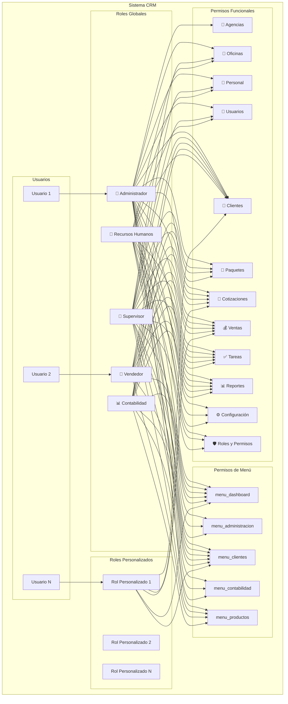
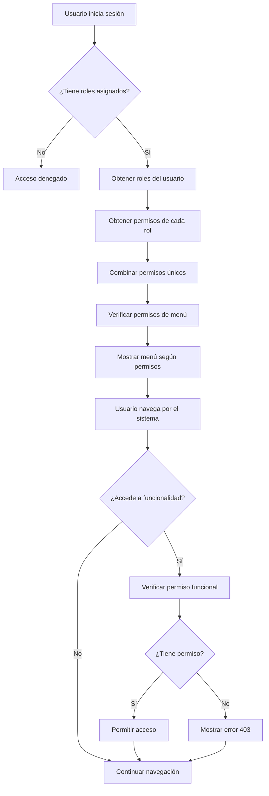
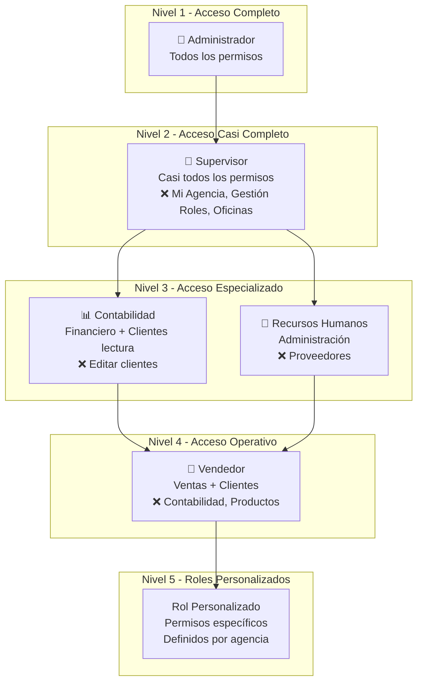
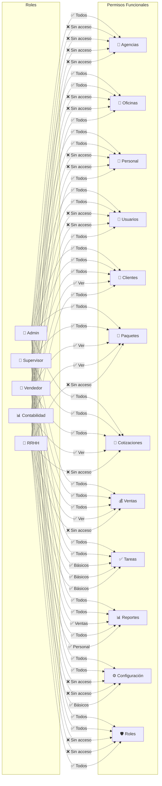
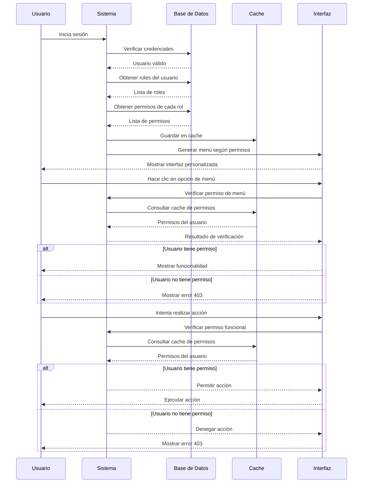
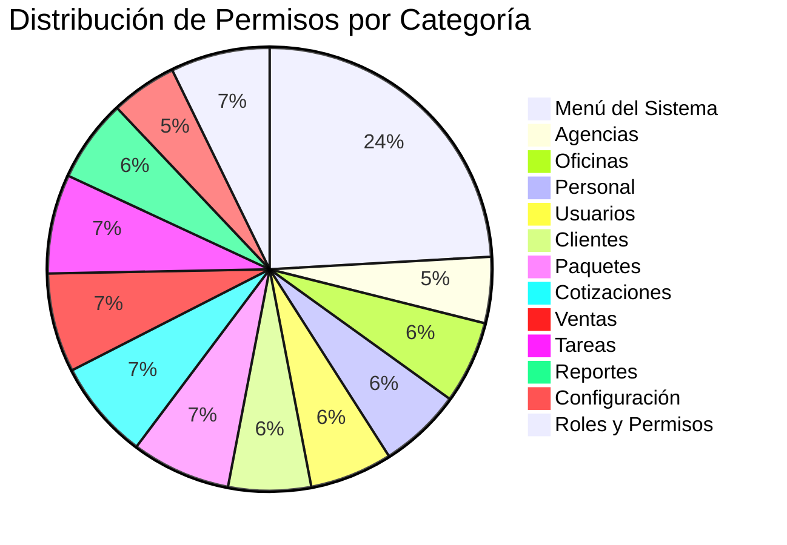
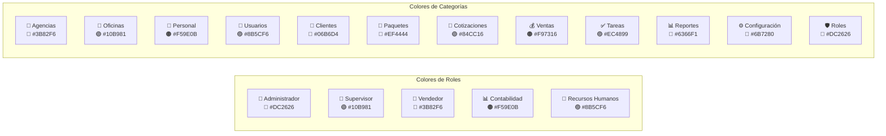

# 🏗️ Diagramas de Arquitectura - Roles y Permisos

## 📊 Arquitectura General del Sistema

## 🔄 Flujo de Asignación de Permisos

## 🎯 Jerarquía de Roles

## 📋 Matriz de Permisos por Rol

## 🔐 Flujo de Autenticación y Autorización

## 📊 Estadísticas del Sistema

## 🎨 Colores y Iconos del Sistema

---

**📝 Diagramas generados con Mermaid**  
**🕒 Última actualización:** {{ date('Y-m-d H:i:s') }}  
**👨‍💻 Sistema CRM - Versión 1.0**
