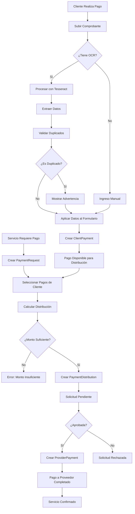
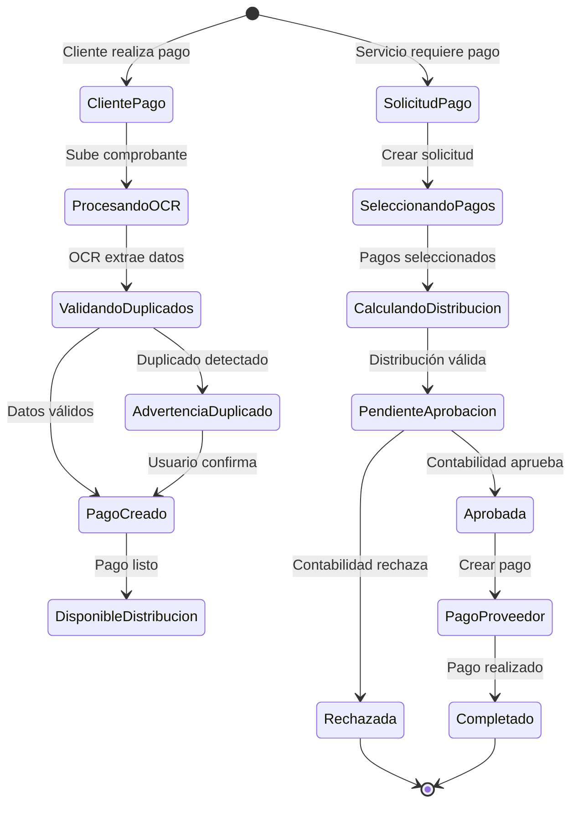
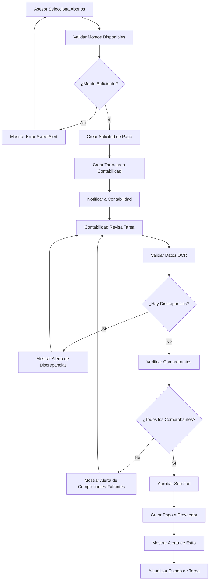

# 💰 Sistema de Pagos del CRM - Documentación Completa

## 📋 Índice
1. [Introducción](#introducción)
2. [Arquitectura del Sistema](#arquitectura-del-sistema)
3. [Flujo de Pagos de Clientes](#flujo-de-pagos-de-clientes)
4. [Flujo de Pagos a Proveedores](#flujo-de-pagos-a-proveedores)
5. [Sistema de Solicitudes de Pago](#sistema-de-solicitudes-de-pago)
6. [Integración con OCR](#integración-con-ocr)
7. [Modelos de Datos](#modelos-de-datos)
8. [Componentes Livewire](#componentes-livewire)
9. [API y Rutas](#api-y-rutas)
10. [Guías de Uso](#guías-de-uso)
11. [Troubleshooting](#troubleshooting)

---

## 🎯 Introducción

El sistema de pagos del CRM es un módulo integral que permite gestionar el flujo completo de dinero en una agencia de viajes. Está diseñado para manejar tanto los pagos que recibe de los clientes como los pagos que se realizan a los proveedores de servicios.

### Características Principales
- ✅ **Pagos de Clientes** con OCR automático
- ✅ **Pagos a Proveedores** con distribución inteligente
- ✅ **Solicitudes de Pago** con aprobación por roles
- ✅ **Distribución de Pagos** automática
- ✅ **Auditoría Completa** de transacciones
- ✅ **Integración con Tesseract OCR**
- ✅ **Validación de Duplicados**
- ✅ **Selección Inteligente de Abonos** por asesor
- ✅ **Creación Automática de Tareas** para contabilidad
- ✅ **Validación Cruzada OCR** con alertas visuales
- ✅ **Comprobantes Obligatorios** para aprobación
- ✅ **Alertas SweetAlert** para situaciones críticas

---

## 🏗️ Arquitectura del Sistema

### Flujo General
```
Cliente → Pago → Distribución → Solicitud → Proveedor
   ↓         ↓         ↓           ↓          ↓
  OCR    Validación  Aprobación  Pago    Servicio
```

### Diagrama de Flujo Detallado



### Flujo de Estados



### Componentes Principales

#### 1. **Pagos de Clientes** 💳
- **Componente**: `CreatePayReserve`
- **Modelo**: `ClientPayment`
- **Funcionalidad**: Registro de pagos recibidos de clientes

#### 2. **Pagos a Proveedores** 🏦
- **Componente**: `CreatePayProvider`
- **Modelo**: `ProviderPayment`
- **Funcionalidad**: Registro de pagos realizados a proveedores

#### 3. **Solicitudes de Pago** 📋
- **Componente**: `CreatePaymentRequest`
- **Modelo**: `PaymentRequest`
- **Funcionalidad**: Solicitudes de pago a proveedores

#### 4. **Distribución de Pagos** 🔄
- **Modelo**: `PaymentDistribution`
- **Funcionalidad**: Vincula pagos de clientes con solicitudes

---

## 💳 Flujo de Pagos de Clientes

### Proceso Completo

#### 1. **Acceso al Formulario**
- Ubicación: Vista de venta (`show-sale.blade.php`)
- Componente: `CreatePayReserve`
- Modal: Flyout modal para agregar pagos

#### 2. **Campos del Formulario**
```php
- payment_date: Fecha del pago
- amount: Valor del abono
- payment_method: Forma de pago
- payment_proof: Soporte de pago (imagen)
- observations: Observaciones adicionales
```

#### 3. **Procesamiento OCR** 🤖
Cuando se sube una imagen de comprobante:

```php
// Proceso automático
1. Verificación de duplicados por hash de imagen
2. Procesamiento con Tesseract OCR
3. Extracción de datos:
   - Monto del pago
   - Fecha del pago
   - Número de comprobante
   - Nombre del banco
   - Número de cuenta
   - Nivel de confianza
4. Aplicación automática al formulario
5. Validación de duplicados por comprobante
```

#### 4. **Validaciones**
- **Duplicados de imagen**: Hash único de imagen
- **Duplicados de comprobante**: Número + fecha
- **Montos**: Validación numérica
- **Fechas**: Formato correcto

#### 5. **Creación del Pago**
```php
ClientPayment::create([
    'agency_id' => $agency->id,
    'request_id' => $request->id,
    'client_id' => $client->id,
    'sale_id' => $sale->id,
    'user_id' => auth()->id(),
    'payment_date' => $payment_date,
    'amount' => $amount,
    'payment_method' => $payment_method,
    'payment_number' => $paymentNumber,
    'balance_due' => $balanceDue,
    // Campos OCR
    'extracted_amount' => $extracted_amount,
    'extracted_date' => $extracted_date,
    'receipt_number' => $receipt_number,
    'bank_name' => $bank_name,
    'account_number' => $account_number,
    'ocr_confidence' => $ocr_confidence,
    'ocr_raw_text' => $ocr_raw_text,
    'image_hash' => $image_hash,
    'ocr_processed' => true,
    'ocr_processed_at' => now(),
]);
```

### Estados del Pago
- **✅ Procesado**: Pago registrado correctamente
- **⚠️ Con advertencias**: Discrepancias en datos OCR
- **❌ Error**: Problemas en validación o procesamiento

---

## 🏦 Flujo de Pagos a Proveedores

### Proceso Completo

#### 1. **Solicitud de Pago**
- Se crea una solicitud desde la vista de venta
- Se seleccionan los pagos de clientes para cubrir el monto
- Se especifica el proveedor y servicio

#### 2. **Distribución de Pagos**
```php
// Cálculo de pagos disponibles
$availablePayments = ClientPayment::where('sale_id', $sale->id)
    ->get()
    ->map(function ($payment) {
        $usedAmount = PaymentDistribution::where('client_payment_id', $payment->id)
            ->join('payment_requests', 'payment_distributions.payment_request_id', '=', 'payment_requests.id')
            ->where('payment_requests.status', '!=', 'rejected')
            ->sum('payment_distributions.amount');
        
        $availableAmount = $payment->amount - $usedAmount;
        
        return [
            'id' => $payment->id,
            'available_amount' => max(0, $availableAmount),
            // ... otros campos
        ];
    });
```

#### 3. **Creación de Solicitud**
```php
PaymentRequest::create([
    'agency_id' => $agency->id,
    'request_id' => $request->id,
    'client_id' => $client->id,
    'sale_id' => $sale->id,
    'service_type' => $service_type,
    'service_id' => $service_id,
    'service_name' => $service_name,
    'provider_name' => $provider_name,
    'total_amount' => $total_amount,
    'payment_amount' => $payment_amount,
    'status' => 'pending',
    'created_by' => $user->name,
    'requested_by' => $user->id,
]);
```

#### 4. **Distribución de Pagos**
```php
foreach ($selected_payments as $paymentId => $amount) {
    if ($amount > 0) {
        $paymentRequest->paymentDistributions()->create([
            'client_payment_id' => $paymentId,
            'amount' => $amount,
        ]);
    }
}
```

### Estados de Solicitud
- **⏳ Pendiente**: Esperando aprobación
- **✅ Aprobada**: Lista para pago
- **❌ Rechazada**: No aprobada

---

## 📋 Sistema de Solicitudes de Pago

### Componente: `AdvisorPaymentRequests`

#### Funcionalidades
- **Listado de solicitudes** con filtros
- **Estados de solicitud** (pendiente, aprobada, rechazada)
- **Filtros por tipo de servicio**
- **Búsqueda por texto**
- **Estadísticas de montos**

#### Filtros Disponibles
```php
// Por estado
'pending' => 'Pendiente',
'approved' => 'Aprobada',
'rejected' => 'Rechazada'

// Por tipo de servicio
'hotel' => 'Hotel',
'ticket' => 'Tiquete',
'transfer' => 'Traslado',
'tour' => 'Tour',
'medical_assist' => 'Asistencia Médica',
'other_service' => 'Otro Servicio'
```

#### Métricas
- **Total de solicitudes**
- **Monto total pendiente**
- **Monto total aprobado**
- **Monto total rechazado**

---

## 🤖 Integración con OCR

### Servicio: `OcrService`

#### Funcionalidades
- **Procesamiento de imágenes** con Tesseract
- **Extracción de datos** estructurados
- **Validación de duplicados**
- **Cálculo de confianza**

#### Datos Extraídos
```php
[
    'extracted_amount' => 150000,      // Monto extraído
    'extracted_date' => '2024-01-15',  // Fecha extraída
    'receipt_number' => '12345',       // Número de comprobante
    'bank_name' => 'Bancolombia',      // Nombre del banco
    'account_number' => '123456789',   // Número de cuenta
    'ocr_confidence' => 85.5,          // Nivel de confianza
    'ocr_raw_text' => 'Texto completo', // Texto extraído
    'image_hash' => 'abc123',          // Hash de la imagen
]
```

#### Validaciones OCR
- **Duplicados de imagen**: Por hash único
- **Duplicados de comprobante**: Por número + fecha
- **Discrepancias de monto**: Tolerancia del 1%
- **Discrepancias de fecha**: Tolerancia de 3 días

---

## 🗄️ Modelos de Datos

### `ClientPayment`
```php
// Campos principales
'agency_id', 'request_id', 'client_id', 'sale_id', 'user_id',
'payment_date', 'reservation_code', 'client_name', 'amount',
'balance_due', 'payment_number', 'payment_method', 'payment_proof',
'status', 'created_by'

// Campos OCR
'extracted_amount', 'extracted_date', 'receipt_number',
'bank_name', 'account_number', 'ocr_confidence', 'ocr_raw_text',
'image_hash', 'ocr_processed', 'ocr_processed_at'
```

### `ProviderPayment`
```php
'sale_id', 'agency_id', 'request_id', 'client_id', 'provider_id',
'client_payment_id', 'reservation_code', 'user_id', 'payment_date',
'client_name', 'payment_method', 'amount', 'payment_number',
'payment_proof', 'provider_charge_concept', 'provider_total_amount',
'created_by'
```

### `PaymentRequest`
```php
'agency_id', 'request_id', 'client_id', 'sale_id', 'service_type',
'service_id', 'service_name', 'provider_name', 'total_amount',
'payment_amount', 'payment_url', 'observations', 'status',
'created_by', 'requested_by', 'payment_proof', 'accounting_observations',
'approved_at', 'approved_by', 'rejected_at', 'rejected_by'
```

### `PaymentDistribution`
```php
'payment_request_id', 'client_payment_id', 'amount'
```

---

## ⚡ Componentes Livewire

### Pagos de Clientes

#### `CreatePayReserve`
- **Ubicación**: `app/Livewire/Pays/Client/CreatePayReserve.php`
- **Vista**: `resources/views/livewire/pays/client/create-pay-reserve.blade.php`
- **Funcionalidades**:
  - Formulario de pago con OCR
  - Validación de duplicados
  - Aplicación automática de datos OCR
  - Manejo de errores y advertencias

#### `IndexPayReserve`
- **Ubicación**: `app/Livewire/Pays/Client/IndexPayReserve.php`
- **Funcionalidades**:
  - Listado de pagos de clientes
  - Filtros y búsqueda
  - Estadísticas de pagos

### Pagos a Proveedores

#### `CreatePaymentRequest`
- **Ubicación**: `app/Livewire/Pays/Provider/CreatePaymentRequest.php`
- **Funcionalidades**:
  - Creación de solicitudes de pago
  - Selección de pagos de clientes
  - Distribución automática

#### `CreatePayProvider`
- **Ubicación**: `app/Livewire/Pays/Provider/CreatePayProvider.php`
- **Funcionalidades**:
  - Registro de pagos a proveedores
  - Vinculación con pagos de clientes

#### `AdvisorPaymentRequests`
- **Ubicación**: `app/Livewire/Pays/Provider/AdvisorPaymentRequests.php`
- **Funcionalidades**:
  - Listado de solicitudes
  - Filtros y búsqueda
  - Estadísticas de solicitudes

---

## 🛣️ API y Rutas

### Rutas de Pagos de Clientes
```php
// Rutas principales
Route::get('/pays/client', [IndexPayReserve::class, 'index']);
Route::post('/pays/client', [CreatePayReserve::class, 'create']);
Route::get('/pays/client/{payment}', [ShowPayReserve::class, 'show']);
Route::put('/pays/client/{payment}', [EditPayReserve::class, 'update']);
```

### Rutas de Pagos a Proveedores
```php
// Rutas principales
Route::get('/pays/provider', [IndexPayProvider::class, 'index']);
Route::post('/pays/provider', [CreatePayProvider::class, 'create']);
Route::get('/pays/provider/{payment}', [ShowPayProvider::class, 'show']);
```

### Rutas de Solicitudes
```php
// Rutas de solicitudes
Route::get('/payment-requests', [IndexPaymentRequest::class, 'index']);
Route::post('/payment-requests', [CreatePaymentRequest::class, 'create']);
Route::get('/payment-requests/{request}', [ShowPaymentRequestDetails::class, 'show']);
```

---

## 📖 Guías de Uso

### 1. **Registrar Pago de Cliente**

#### Paso a Paso
1. **Acceder a la venta** desde el dashboard
2. **Hacer clic en "Agregar pago"** en el panel de pagos
3. **Completar el formulario**:
   - Fecha del pago
   - Valor del abono
   - Forma de pago
   - Soporte de pago (opcional)
4. **Subir comprobante** (si aplica):
   - El sistema procesará automáticamente con OCR
   - Se aplicarán los datos extraídos
   - Se validarán duplicados
5. **Revisar datos aplicados** por OCR
6. **Guardar el pago**

#### Casos Especiales
- **Comprobante duplicado**: El sistema mostrará advertencia
- **Datos OCR incorrectos**: Se pueden editar manualmente
- **Error de procesamiento**: Se puede reintentar

### 2. **Crear Solicitud de Pago a Proveedor**

#### Paso a Paso
1. **Acceder a la venta** desde el dashboard
2. **Hacer clic en "Solicitar pago"** en el servicio deseado
3. **Seleccionar pagos de clientes** para cubrir el monto
4. **Verificar distribución** de pagos
5. **Agregar observaciones** (opcional)
6. **Crear solicitud**

#### Validaciones
- **Monto suficiente**: Los pagos seleccionados deben cubrir el monto
- **Pagos disponibles**: Solo se pueden usar pagos no distribuidos
- **Servicio válido**: El servicio debe estar en estado correcto

### 3. **Gestionar Solicitudes de Pago**

#### Para Asesores
- **Ver listado** de solicitudes creadas
- **Filtrar por estado** o tipo de servicio
- **Buscar por texto** en observaciones
- **Ver estadísticas** de montos

#### Para Contabilidad
- **Aprobar solicitudes** pendientes
- **Rechazar solicitudes** con motivo
- **Registrar pagos** a proveedores
- **Generar reportes** de pagos

---

## 🔧 Troubleshooting

### Problemas Comunes

#### 1. **Error de OCR**
```bash
# Verificar instalación de Tesseract
php artisan tesseract:install --check

# Verificar permisos de archivos
chmod -R 755 storage/app/public
```

#### 2. **Pagos Duplicados**
- **Causa**: Mismo comprobante usado múltiples veces
- **Solución**: Verificar hash de imagen y número de comprobante
- **Prevención**: El sistema valida automáticamente

#### 3. **Distribución Incorrecta**
- **Causa**: Pagos de clientes insuficientes
- **Solución**: Verificar montos disponibles antes de crear solicitud
- **Validación**: El sistema valida automáticamente

#### 4. **Errores de Validación**
- **Causa**: Datos faltantes o incorrectos
- **Solución**: Revisar mensajes de error específicos
- **Logs**: Verificar logs de Laravel para detalles

### Logs Importantes

#### OCR
```php
Log::info('OCR procesado exitosamente', [
    'confidence' => $result['ocr_confidence'],
    'extracted_data' => $result
]);
```

#### Pagos
```php
Log::debug('Pago creado correctamente', ['id' => $pay->id]);
Log::error('Error al crear pago', ['error' => $e->getMessage()]);
```

#### Solicitudes
```php
Log::info('Solicitud de pago creada', [
    'request_id' => $paymentRequest->id,
    'amount' => $paymentRequest->payment_amount
]);
```

---

## 📊 Métricas y Reportes

### Métricas Disponibles
- **Total de pagos de clientes** por período
- **Total de pagos a proveedores** por período
- **Solicitudes pendientes** por estado
- **Eficiencia de OCR** (confianza promedio)
- **Duplicados detectados** por período

### Reportes Generados
- **Reporte de pagos** por cliente
- **Reporte de proveedores** por agencia
- **Reporte de solicitudes** por estado
- **Reporte de auditoría** de transacciones

---

## 🔒 Seguridad y Auditoría

### Medidas de Seguridad
- **Validación de duplicados** automática
- **Hash único** de imágenes
- **Logs de auditoría** completos
- **Validación de roles** para operaciones

### Auditoría
- **Registro de todas las operaciones**
- **Trazabilidad completa** de pagos
- **Logs de OCR** para verificación
- **Historial de cambios** en solicitudes

---

## 🚀 Mejoras Futuras

### Funcionalidades Planificadas
- **Integración con pasarelas de pago**
- **Notificaciones automáticas** por email
- **Reportes avanzados** con gráficos
- **API REST** para integraciones externas
- **Validación de comprobantes** con blockchain

### Optimizaciones
- **Cache de consultas** frecuentes
- **Procesamiento OCR** en background
- **Compresión de imágenes** automática
- **Indexación de base de datos** optimizada

---

## 🏢 Flujo Corporativo de Pagos

### Proceso Formal de Aprobación

#### 1. **Selección de Abonos por Asesor** 👨‍💼

##### Funcionalidades
- **Visualización de abonos disponibles** con saldo pendiente
- **Identificación de abonos utilizados** en otras solicitudes
- **Cálculo automático de saldo disponible** por abono
- **Selección múltiple** de abonos para cubrir el monto total
- **Validación en tiempo real** de montos suficientes

##### Interfaz de Usuario
```php
// Componente: CreatePaymentRequest
public function getAvailablePaymentsProperty()
{
    return ClientPayment::where('sale_id', $this->sale->id)
        ->get()
        ->map(function ($payment) {
            $usedAmount = PaymentDistribution::where('client_payment_id', $payment->id)
                ->join('payment_requests', 'payment_distributions.payment_request_id', '=', 'payment_requests.id')
                ->where('payment_requests.status', '!=', 'rejected')
                ->sum('payment_distributions.amount');
            
            $availableAmount = $payment->amount - $usedAmount;
            
            return [
                'id' => $payment->id,
                'payment_date' => $payment->payment_date,
                'amount' => $payment->amount,
                'available_amount' => max(0, $availableAmount),
                'used_amount' => $usedAmount,
                'is_fully_used' => $availableAmount <= 0,
                'payment_method' => $payment->payment_method,
                'payment_number' => $payment->payment_number,
                'has_ocr_data' => $payment->hasOcrData(),
                'ocr_confidence' => $payment->getOcrConfidencePercentage()
            ];
        })
        ->filter(function ($payment) {
            return $payment['available_amount'] > 0;
        });
}
```

##### Validaciones
- **Monto suficiente**: Suma de abonos seleccionados >= monto requerido
- **Abonos disponibles**: Solo se pueden seleccionar abonos con saldo > 0
- **Estado válido**: Abonos deben estar en estado "procesado"

#### 2. **Creación Automática de Tareas** 📋

##### Proceso de Creación
Cuando el asesor confirma la selección de abonos:

```php
// En CreatePaymentRequest::createPaymentRequest()
public function createPaymentRequest()
{
    // ... validaciones existentes ...
    
    // Crear la solicitud de pago
    $paymentRequest = PaymentRequest::create([
        // ... datos existentes ...
        'status' => 'pending',
        'created_by' => $user->name,
        'requested_by' => $user->id,
    ]);

    // Crear distribución de pagos
    foreach ($this->selected_payments as $paymentId => $amount) {
        if ($amount > 0) {
            $paymentRequest->paymentDistributions()->create([
                'client_payment_id' => $paymentId,
                'amount' => $amount,
            ]);
        }
    }

    // 🆕 CREAR TAREA PARA CONTABILIDAD
    $this->createAccountingTask($paymentRequest);
    
    // ... resto del proceso ...
}

private function createAccountingTask(PaymentRequest $paymentRequest)
{
    $task = Task::create([
        'title' => "Validar solicitud de pago - {$paymentRequest->service_name}",
        'description' => $this->generateTaskDescription($paymentRequest),
        'priority' => 'high',
        'due_date' => now()->addDays(2),
        'assigned_to' => $this->getAccountingUserId(),
        'created_by' => auth()->id(),
        'task_type' => 'payment_validation',
        'related_entity_type' => 'PaymentRequest',
        'related_entity_id' => $paymentRequest->id,
        'status' => 'pending',
        'metadata' => [
            'payment_request_id' => $paymentRequest->id,
            'service_type' => $paymentRequest->service_type,
            'total_amount' => $paymentRequest->total_amount,
            'payment_amount' => $paymentRequest->payment_amount,
            'provider_name' => $paymentRequest->provider_name,
            'client_name' => $this->client->name,
            'selected_payments' => $this->selected_payments,
        ]
    ]);

    // Notificar al usuario asignado
    $this->notifyAccountingUser($task);
}

private function generateTaskDescription(PaymentRequest $paymentRequest): string
{
    $description = "Validar solicitud de pago para el servicio: {$paymentRequest->service_name}\n\n";
    $description .= "**Detalles del Servicio:**\n";
    $description .= "- Proveedor: {$paymentRequest->provider_name}\n";
    $description .= "- Monto total: $" . number_format($paymentRequest->total_amount, 0, ',', '.') . "\n";
    $description .= "- Monto a pagar: $" . number_format($paymentRequest->payment_amount, 0, ',', '.') . "\n\n";
    
    $description .= "**Abonos Seleccionados:**\n";
    foreach ($this->selected_payments as $paymentId => $amount) {
        $payment = ClientPayment::find($paymentId);
        $description .= "- Abono #{$payment->payment_number}: $" . number_format($amount, 0, ',', '.') . "\n";
    }
    
    $description .= "\n**Acciones Requeridas:**\n";
    $description .= "1. Validar datos extraídos por OCR\n";
    $description .= "2. Verificar comprobantes de pago\n";
    $description .= "3. Aprobar o rechazar la solicitud\n";
    
    return $description;
}
```

##### Datos de la Tarea
- **Título**: "Validar solicitud de pago - [Nombre del Servicio]"
- **Prioridad**: Alta
- **Fecha límite**: 2 días hábiles
- **Asignado a**: Usuario de contabilidad
- **Tipo**: `payment_validation`
- **Metadatos**: Información completa de la solicitud

#### 3. **Validación Cruzada con Tesseract** 🔍

##### Proceso de Validación
Cuando contabilidad accede a la tarea:

```php
// Componente: ValidatePaymentRequest
public function validateOcrData()
{
    $discrepancies = [];
    
    foreach ($this->paymentRequest->paymentDistributions as $distribution) {
        $clientPayment = $distribution->clientPayment;
        
        // Validar monto
        if ($clientPayment->hasAmountDiscrepancy()) {
            $discrepancies[] = [
                'type' => 'amount',
                'payment_id' => $clientPayment->id,
                'entered_amount' => $clientPayment->amount,
                'extracted_amount' => $clientPayment->extracted_amount,
                'difference' => abs($clientPayment->amount - $clientPayment->extracted_amount),
                'message' => "Discrepancia en monto del abono #{$clientPayment->payment_number}"
            ];
        }
        
        // Validar fecha
        if ($clientPayment->hasDateDiscrepancy()) {
            $discrepancies[] = [
                'type' => 'date',
                'payment_id' => $clientPayment->id,
                'entered_date' => $clientPayment->payment_date,
                'extracted_date' => $clientPayment->extracted_date,
                'message' => "Discrepancia en fecha del abono #{$clientPayment->payment_number}"
            ];
        }
        
        // Validar confianza OCR
        if (!$clientPayment->hasHighOcrConfidence()) {
            $discrepancies[] = [
                'type' => 'confidence',
                'payment_id' => $clientPayment->id,
                'confidence' => $clientPayment->getOcrConfidencePercentage(),
                'message' => "Baja confianza OCR ({$clientPayment->getOcrConfidencePercentage()}%) en abono #{$clientPayment->payment_number}"
            ];
        }
    }
    
    $this->discrepancies = $discrepancies;
    $this->hasDiscrepancies = count($discrepancies) > 0;
    
    if ($this->hasDiscrepancies) {
        $this->showDiscrepancyAlert();
    }
}
```

##### Tipos de Discrepancias
1. **Monto**: Diferencia entre monto ingresado y extraído por OCR
2. **Fecha**: Diferencia entre fecha ingresada y extraída por OCR
3. **Confianza**: Nivel de confianza OCR < 70%
4. **Comprobante**: Número de comprobante duplicado o inválido

#### 4. **Comprobantes Obligatorios** 📎

##### Validación de Comprobantes
```php
// En el proceso de aprobación
public function approvePaymentRequest()
{
    // Validar que todos los abonos tengan comprobantes
    $missingProofs = $this->validateRequiredProofs();
    
    if (count($missingProofs) > 0) {
        $this->showMissingProofAlert($missingProofs);
        return;
    }
    
    // Validar discrepancias OCR
    if ($this->hasDiscrepancies) {
        $this->showDiscrepancyAlert();
        return;
    }
    
    // Proceder con la aprobación
    $this->processApproval();
}

private function validateRequiredProofs(): array
{
    $missingProofs = [];
    
    foreach ($this->paymentRequest->paymentDistributions as $distribution) {
        $clientPayment = $distribution->clientPayment;
        
        if (!$clientPayment->payment_proof) {
            $missingProofs[] = [
                'payment_id' => $clientPayment->id,
                'payment_number' => $clientPayment->payment_number,
                'amount' => $clientPayment->amount,
                'message' => "Falta comprobante para el abono #{$clientPayment->payment_number}"
            ];
        }
    }
    
    return $missingProofs;
}
```

##### Reglas de Validación
- **Todos los abonos** deben tener comprobante adjunto
- **Comprobantes válidos**: Imágenes en formato JPG, PNG, PDF
- **Tamaño máximo**: 2MB por archivo
- **Calidad mínima**: Resolución suficiente para OCR

#### 5. **Alertas SweetAlert** ⚠️

##### Implementación de Alertas
```javascript
// En el componente Livewire
public function showDiscrepancyAlert()
{
    $this->dispatch('show-swal', [
        'type' => 'warning',
        'title' => 'Discrepancias Detectadas',
        'text' => 'Se encontraron discrepancias entre los datos ingresados y los extraídos por OCR. Por favor, revise la información antes de continuar.',
        'showCancelButton' => true,
        'confirmButtonText' => 'Revisar Detalles',
        'cancelButtonText' => 'Cancelar',
        'confirmButtonColor' => '#f59e0b',
        'cancelButtonColor' => '#6b7280'
    ]);
}

public function showMissingProofAlert($missingProofs)
{
    $proofList = $missingProofs->map(function($proof) {
        return "• Abono #{$proof['payment_number']}: $" . number_format($proof['amount'], 0, ',', '.');
    })->join('\n');
    
    $this->dispatch('show-swal', [
        'type' => 'error',
        'title' => 'Comprobantes Faltantes',
        'text' => "Los siguientes abonos requieren comprobantes:\n\n{$proofList}\n\nNo se puede aprobar la solicitud sin estos documentos.",
        'showCancelButton' => false,
        'confirmButtonText' => 'Entendido',
        'confirmButtonColor' => '#dc2626'
    ]);
}

public function showApprovalSuccessAlert()
{
    $this->dispatch('show-swal', [
        'type' => 'success',
        'title' => 'Solicitud Aprobada',
        'text' => 'La solicitud de pago ha sido aprobada exitosamente. Se ha creado el pago al proveedor.',
        'showCancelButton' => false,
        'confirmButtonText' => 'Continuar',
        'confirmButtonColor' => '#10b981'
    ]);
}
```

##### Tipos de Alertas
1. **⚠️ Advertencia**: Discrepancias OCR detectadas
2. **❌ Error**: Comprobantes faltantes
3. **✅ Éxito**: Solicitud aprobada exitosamente
4. **ℹ️ Información**: Cambios de estado o notificaciones

##### Configuración de SweetAlert
```javascript
// En el layout principal
document.addEventListener('livewire:initialized', () => {
    Livewire.on('show-swal', (data) => {
        Swal.fire({
            icon: data.type,
            title: data.title,
            text: data.text,
            showCancelButton: data.showCancelButton || false,
            confirmButtonText: data.confirmButtonText || 'OK',
            cancelButtonText: data.cancelButtonText || 'Cancelar',
            confirmButtonColor: data.confirmButtonColor || '#3b82f6',
            cancelButtonColor: data.cancelButtonColor || '#6b7280',
            background: document.documentElement.classList.contains('dark') ? '#1e293b' : '#ffffff',
            color: document.documentElement.classList.contains('dark') ? '#f1f5f9' : '#1f2937'
        }).then((result) => {
            if (result.isConfirmed && data.confirmAction) {
                Livewire.dispatch(data.confirmAction);
            }
        });
    });
});
```

### Flujo Completo Corporativo



### Beneficios del Flujo Corporativo

1. **🔒 Control de Calidad**: Validación cruzada OCR obligatoria
2. **📋 Trazabilidad**: Tareas automáticas para seguimiento
3. **⚠️ Prevención de Errores**: Alertas visuales para discrepancias
4. **📎 Documentación**: Comprobantes obligatorios para aprobación
5. **👥 Colaboración**: Flujo claro entre asesor y contabilidad
6. **📊 Auditoría**: Registro completo de todas las validaciones

---

## 📞 Soporte

### Contacto
- **Desarrollador**: MVP Solutions 360
- **Email**: soporte@mvpsolutions360.com
- **Documentación**: `/documentacion/servicios/pagos/`

### Recursos Adicionales
- **Logs del sistema**: `storage/logs/laravel.log`
- **Documentación OCR**: `documentacion/implementacion/TESSERACT_README.md`
- **API Documentation**: `documentacion/api/`

---

*Última actualización: Enero 2025*
*Versión del sistema: 1.0.0*
